# Zen for iOS

Zen Browser's interface, rebuilt natively on WebKit.

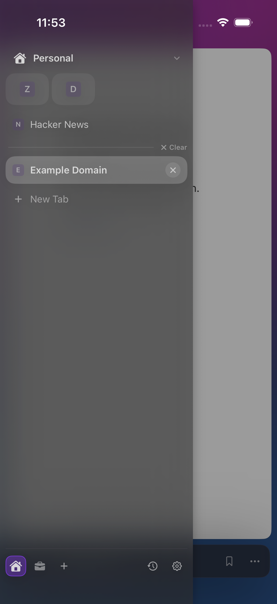

## Why this is not Gecko

Desktop Zen is a Firefox fork, so it renders with Gecko. Neither half of that
travels to iOS:

- **Apple requires WebKit.** Outside the EU, App Store guideline 2.5.6 still
  requires every browser to render with WKWebView. The alternative-engine
  entitlement introduced for the DMA is EU-only and needs a separate binary,
  a developer account in good standing and an Apple-approved engine — Gecko is
  not one.
- **Gecko has no iOS target.** There is no `--target=ios` in mozilla-central.
  Mozilla ship Firefox for iOS as a WKWebView shell for exactly this reason.

So this app does not try to port the engine. It ports the *browser* — the part
people actually choose Zen for. Spaces, vertical tabs, essentials, glance,
split view and compact mode are interface ideas, and interface ideas port fine.

Everything visual is derived from Zen's own source rather than eyeballed from
screenshots: the palette is a line-by-line port of `zen-theme.css`'s
`color-mix()` chain, the gradients follow `ZenGradientGenerator.mjs`, and the
metrics in `ZenMetrics.swift` are quoted from Zen's stylesheets with the
touch-sized deviations noted inline.

## Build and run

Requires **Xcode 27.0** (build 27A266a) and **xcodegen 2.46.0**
(`brew install xcodegen`). Deployment target iOS 17.0; iPhone and iPad.

```bash
cd ios
xcodegen generate
open Zen.xcodeproj          # or build from the command line:

xcodebuild build -scheme Zen -project Zen.xcodeproj \
  -destination 'generic/platform=iOS Simulator' \
  -derivedDataPath /tmp/zenbuild CODE_SIGNING_ALLOWED=NO

xcodebuild test -scheme Zen -project Zen.xcodeproj \
  -destination 'platform=iOS Simulator,name=iPhone 17' \
  -derivedDataPath /tmp/zenbuild CODE_SIGNING_ALLOWED=NO
```

`Zen.xcodeproj` is committed alongside `project.yml` so the repo is clonable
without xcodegen, but `project.yml` is the source of truth — regenerate after
adding files.

There are **no third-party Swift dependencies**: SwiftUI, WebKit and Foundation
only. There is exactly one vendored third-party file — Mozilla's
**Readability.js** (Apache-2.0), which reader mode runs in the page, as Firefox
and Zen desktop do. It is checked in verbatim at `Sources/Reader/`, with its
provenance in a header comment; there is no package manager involved.

### Screenshots

The images in this README are produced by a separate scheme that drives the app
through each state and writes PNGs into the UI-test runner's container:

```bash
xcodebuild test -scheme ZenScreenshots -project Zen.xcodeproj \
  -destination 'platform=iOS Simulator,name=iPhone 17' \
  -derivedDataPath /tmp/zenbuild CODE_SIGNING_ALLOWED=NO
cp "$(xcrun simctl get_app_container booted com.morton.zen.uitests.xctrunner data)/Documents/"*.png \
  docs/screenshots/
```

It is deliberately *not* part of `-scheme Zen`'s test action: it needs the
network and takes minutes, where the unit tests take under a second.

## Feature matrix

| # | Feature | State | Notes |
|---|---------|-------|-------|
| 1 | **Spaces** — named, icon, gradient theme | Done | Emoji or SF Symbol icon. Each space gets its own `WKWebsiteDataStore(forIdentifier:)`, so cookies and logins are isolated per space. |
| 1 | Space swipe to switch | Done | Horizontal drag on the sidebar translates the list live, then springs, as `ZenSpacesSwipe` does. |
| 1 | Space switcher strip | Done | Along the sidebar bottom, each chip previewing its own accent. |
| 2 | **Vertical tab sidebar** | Done | Slide-in drawer on iPhone (edge swipe or toolbar button), persistent on iPad. |
| 2 | Sidebar edge (#008A8) | Done | Settings → Sidebar position: Left / Right, as Zen desktop's own `sidebar.position` allows. Moves the drawer/persistent sidebar and its edge-swipe reveal, mirrors the URL bar's swipe-to-open gesture and moves the toolbar button to match. Animated, with a haptic on toggle. |
| 2 | Swipe to close a tab row | Done | Pull left past the threshold, with a haptic at the threshold itself. |
| 2 | Swipe the URL bar to the sidebar | Done | Right or up on the bar opens the drawer, left or down closes it (#0089F). The direction → action map is a table, so the planned URL-bar customisation can reassign it. |
| 2 | New Tab strip | Done | Full-width, 44pt, pinned below the tab list rather than scrolling away inside it (#0089F). |
| 2 | Reorder by drag | Partial | Essentials reorder by drag. Pinned and normal rows reorder through the model (`moveTab`) but have no drag gesture wired up yet. |
| 2 | Unloaded tabs | Done | An LRU pool keeps at most six live `WKWebView`s; the rest keep URL, title, favicon and scroll offset and reload on selection. Unloaded rows render dimmed and desaturated. |
| 3 | **Essentials** — global pinned grid | Done | Four across, favicon-only tiles, shared across every space, capped at 12 as upstream is. |
| 3 | Per-space pinned tabs | Done | Above the separator; closing one resets it to its pinned URL instead of destroying it. |
| 3 | Separator with clear affordance | Done | |
| 4 | **Omnibox** — floating bottom pill | Done | At the bottom on iPhone for thumb reach; upstream's is inline at the top. |
| 4 | Centered floating search box | Done | 62px, 12px radius, the large soft shadow, 252px result list. |
| 4 | Suggestions | Done | History (frecency-ranked), engine autocomplete, and a subset of Zen's urlbar global actions. |
| 4 | URL vs search detection | Done | Covered by tests, including `localhost`, bare IPs, `IP:port`, `.lan`, and refusing `javascript:`. |
| 4 | Single-word input | Done | A *bare* word (`meitner`) still searches — it is indistinguishable from `swift` — but the omnibox offers the other reading explicitly as the second row, "Go to http://meitner". Once the host is in history the default flips: the top hit navigates and *searching* becomes the second row. |
| — | **Load failures** | Done | A real error page with host, port, reason, error code, Retry, scheme flip, common-port suggestions and a Local Network hint. 10s timeout with a watchdog for addresses that neither answer nor fail. |
| 4 | Search engine choice | Done | DuckDuckGo (default), Google, Bing, Startpage, Ecosia. Startpage has no public autocomplete endpoint and borrows DuckDuckGo's. |
| 4 | Desktop/mobile user agent | Done | Global setting; applied per web view at creation. |
| — | **Haptics** (#00897) | Done | One service, one semantic-event table, four levels (Off / Subtle / Normal / Rich, default Normal). Impacts, selection ticks and notifications for ~30 moments, plus Core Haptics patterns for three. Never during a scroll, never backgrounded, never twice for one action. Tested through a recording backend. |
| — | **Video and pop-out** (#008B0) | Done | Inline playback, element full screen, AirPlay and Picture in Picture are all enabled in one place (`WebEngine.applyMediaPolicy`), and a page decides for itself when to start playing — `mediaTypesRequiringUserActionForPlayback` was `.audio`, which reads as the polite setting and in fact breaks muted autoplay. `UIBackgroundModes: audio` plus an `AVAudioSession` in `.playback`/`.moviePlayback` keep media going when backgrounded or locked; the session is claimed on the first page that plays and released by the last, never at launch. **Pop out video** in the overflow and page context menus picks the page's most relevant `<video>` — playing first, then largest visible — and asks for PiP. Cross-origin `<iframe>` embeds are out of reach; YouTube's mobile site is same-origin and works. **The iOS Simulator has no Picture in Picture at all** (`document.pictureInPictureEnabled` is false), so the request is gated on `webkitSupportsPresentationMode` rather than on the method existing — otherwise it reports success for a call that silently does nothing — and the floating window itself can only be verified on hardware. |
| — | **Hidden status bar** (#00899, #008A9) | Done | Off by default with a Settings toggle. It takes away the clock, the signal and the battery — and nothing else. The Dynamic Island is hardware, iOS still reports a top safe-area inset for it, and the content card still starts below that inset; the setting is not an input to the layout at all (`PageTopInsets`). |
| 5 | **Compact mode** (#008AF) | Done | Keeps Zen's two independent toggles (hide sidebar / hide toolbar), persisted. Three bar states rather than two: the full bar falls to a **pill** — favicon and domain, nothing else — once the page has been still for the hide delay (3 s by default), and then to nothing. Scrolling brings back the pill and only the pill; a **tap** on the pill is the one thing that expands the full bar. Swiping up from either opens the tab drawer, alongside the existing swipe right. |
| 5 | Reveal | Done | A drag-handle grabber above the home indicator (36×6pt pill, 44pt hit area): tap or pull up to reveal, tap the page or scroll to hide. Upstream reveals on *hover* within 10px of an edge; the touch translation of that sat on top of the iOS home gesture and lost, so it is an explicit target instead. |
| 6 | **Split view** — two panes | Done | Side by side when wide (iPad, landscape iPhone), stacked when tall. Draggable divider with the same 7%-of-parent minimum. Focused pane gets the 2px accent outline. |
| 6 | 3–4 panes, grid/hsep layouts | **TODO** | Upstream's `MAX_TABS = 4` with a nested split tree. The model holds one secondary pane; extending it means replacing `splitSecondaryTabID` with a node tree. |
| 7 | **Glance** | Done | Long-press a link → "Open in Glance", or from a tab row's context menu. Card over a dimmed page with close / expand-to-tab / split-out. |
| 7 | Arc open/close animation | Partial | Upstream animates the card along an 80-step arc from the clicked element, with an `easeOutBack` overshoot and a snapshot of the source element. We use a spring scale-and-fade from centre. |
| 7 | Drag to dismiss | Done | An addition, not a port — upstream has a cursor and does not need one. |
| 8 | **Session restore** | Done | Spaces, tabs, tier, active tab per space, scroll offset and settings, as JSON in Application Support. Written through `replaceItemAt`, so a jetsam mid-write cannot truncate it. Snapshots are sanitised on load. |
| 9 | **History** with search | Done | JSON, capped at 5,000 entries, frecency-ish ranking. |
| 9 | **Bookmarks** | Done | Toggle in the omnibox pill; managed from the same sheet as history. |
| 10 | **Theme** — light/dark + Zen tokens | Done | Follows the system unless a themed space overrides it, which is what upstream's `shouldBeDarkMode()` does. |
| 10 | Per-space accent picker | Done | Swatches plus a harmony picker; the other dots derive from the same hue offsets the desktop wheel snaps to. |
| 10 | **Colour tool** | Done | A real accent picker: a Canvas hue/saturation wheel with a separate brightness track, HSB and RGB sliders with live numeric readouts, and hex / RGB-triplet entry validated with specific errors. Recent colours and the space's own gradient stops are one-tap targets; the system `ColorPicker` is offered as a secondary route for the eyedropper. Every path writes the same `ZenColor`, so the zen-theme.css derivations are unchanged. |
| 10 | **Appearance** | Done | Follow System / Light / Dark, matching Zen's `zen.view.window.scheme`. An explicit choice overrides a space's `shouldBeDarkMode()` contrast heuristic; Follow System lets it apply. |
| 10 | Film grain | Partial | A generated noise tile at `.overlay` blend. Upstream ships `grain-bg.png` at `mix-blend-mode: hard-light`, which SwiftUI has no equivalent for. |
| 11 | **Keyboard shortcuts** | Done | ⌘T, ⌘W, ⌘L, ⌃Tab / ⌃⇧Tab, ⇧⌘S, ⇧⌘E, plus ⌘F and ⌃⇧← / ⌃⇧→. Each fires a selection tick, because a hardware keyboard gives no other confirmation the chord was caught. |
| 12 | **Share sheet** | Done | From the omnibox overflow menu. |
| 12 | **Find in page** | Partial | Uses WKWebView's `find(_:configuration:)`. `WKFindResult` reports only found/not-found, so there is no "3 of 12" counter. |
| 13 | **Firefox Sync** — Mozilla account | Done | OAuth + PKCE with scoped-keys delivery: an ephemeral P-256 key goes up as `keys_jwk`, the returned `keys_jwe` comes back down as the oldsync key. Mozilla's server accepts the request and serves the sign-in form; **no sign-in has been completed** — see *Sync: first run*. |
| 13 | Token server and Hawk | Done | `token.services.mozilla.com/1.0/sync/1.5` with `X-KeyID`, then Hawk on every storage request. Checked against the Hawk specification's own vectors. |
| 13 | Sync 1.5 storage | Done | `info/collections`, `meta/global`, `crypto/keys`, `X-If-Unmodified-Since` on every write, the batch protocol past 100 records or 1 MB, offset paging, backoff. |
| 13 | **Zen spaces engine** | Done | Zen's own `spaces` collection at engine version 3, in the desktop's record schema — space, tab and layout records, with containers, folders and split groups held rather than deleted. |
| 13 | Bookmarks | Partial | Leaf-level, into Mobile Bookmarks. Desktop folders are held, and their contents appear here unfiled — Zen for iOS has no bookmark folders to put them in. |
| 13 | Open tabs | Done | Ours published; other devices' shown in the sidebar under "Other devices", tap to open here. |
| 13 | History | Done | Additive merge — last-writer-wins on history would delete evidence of a visit. |
| 14 | **Passwords** — iOS Password AutoFill | Done | Not a feature so much as a suppression audit: no custom `inputAccessoryView`, no emptied `inputAssistantItem`, no user scripts in page content, persistent per-space stores. Verified in the simulator against a local https fixture, showing the same `SystemInputAssistantView` / `kb-autofill-key` Safari shows. See *Passwords*. |
| 14 | Passkeys (WebAuthn) | Done | WebKit's own; Zen neither sees nor stores them. The platform authenticator answers `false` in a simulator. |
| 14 | A password manager of Zen's own | **Not on this branch** | iOS gives a third-party browser no way to be one for other apps. A native 1Password Connect / Vaultwarden panel *inside* Zen is being tried on `experimental` (#008AD). |
| 12 | **Reader mode** (#008BC) | Done | WebKit exposes no reader API to a third-party app, so Zen does what Firefox and Zen desktop do and runs **Mozilla's Readability.js** over the document. The cheap 4 KB probe decides whether to offer the reader on every page that loads; the 90 KB parser is only evaluated when you ask. Neither is a user script. See *Reader*. |
| 12 | Reader appearance controls | Done | Nine faces, five themes including a custom one wired to #0088F's colour tool, size, line height, letter spacing, paragraph gap, column width, alignment with hyphenation, an in-app dim, images, drop cap, reading progress and estimated time, read aloud with the spoken sentence highlighted, and a per-site memory for all of it. |

### Also not done

- **Folders, live folders, mods, boosts, workspace routing.** Upstream features
  outside this brief.
- **Tab drag between spaces.**
- **Multi-window / Stage Manager** on iPad (`UIApplicationSupportsMultipleScenes`
  is `false`).
- **Downloads.** Links to non-renderable content are handed to the system.
- **Private browsing.** The per-space data store design makes this
  straightforward — an ephemeral `WKWebsiteDataStore` — but it is not wired up.
- **Favicons for never-visited tabs.** A restored tab shows a monogram disc
  until it is first loaded, because favicons are captured on navigation.

## Architecture

```
ios/
  project.yml              xcodegen spec — source of truth for the project
  Sources/
    App/                   ZenApp, RootView (layout, compact mode, shortcuts),
                           ContentArea, Info.plist
    Theme/                 ZenColor   — sRGB + CSS color-mix semantics
                           ZenPalette — the derived token set from zen-theme.css
                           ZenGradient / ZenGradientView — ZenGradientGenerator
                           ZenMetrics — constants quoted from Zen's stylesheets
    Model/                 Space, Tab, SearchEngine + URLDetector, BrowserState
    Persistence/           JSONFileStore (atomic), SessionStore, History/Bookmarks
    Web/                   WebEngine (per-space data stores, LRU pool), WebView
    Reader/                Readability.js + Readability-readerable.js (vendored,
                           Apache-2.0), the two scripts that drive them, the
                           settings value and its themes, the HTML/CSS template,
                           the sentence chunker and the speech transport, and
                           the per-site memory
    Services/              Haptics — the semantic event table and the
                           UIKit / Core Haptics backend behind it
                           MediaSession — who owns the audio session, and
                           when it is claimed and let go
    Sync/                  Crypto/    — HKDF, AES-CBC, the BSO payload format,
                                        Hawk, the scoped-key JWE, PKCE
                           Account/   — FxA OAuth, the sign-in sheet and its
                                        origin allow-list, the token server,
                                        the keychain
                           Storage/   — the Sync 1.5 client and its records
                           Engines/   — spaces, bookmarks, tabs, history,
                                        clients, and the shadow they diff against
                           SyncService — one sync, start to finish
    UI/                    Sidebar/, Omnibox/, Glance/, Split/, History/,
                           Settings/, Reader/, plus NewTabPage and FindBar
  Tests/ZenTests/          531 unit tests
  Tests/ZenUITests/        the screenshot driver
```

**`BrowserState` is the single source of truth.** Tabs live in one flat ordered
array; a "section" (essentials, this space's pinned tabs, its normal tabs) is a
filtered view of that array, so reordering is a splice and the session snapshot
stays a single list. This is the shape upstream converges on too — Zen keeps one
tab strip per space and filters by `zen-essential` and pinned state for display.

**The palette is computed, not chosen.** `zen-theme.css` declares exactly one
input — `--zen-primary-color`, the space accent — and `color-mix()`es it against
the branding base (`#101010` dark, `#e2e2e2` paper) to produce every other
token. `ZenPalette` ports that chain literally. `ZenColor.mix` implements CSS's
*premultiplied* alpha rule, without which every mix against `transparent` comes
out muddy instead of translucent.

**The web view pool, not SwiftUI, owns web view lifetime.** A `WKWebView` costs
a content process, so one per tab gets the app jetsammed with a few dozen tabs
open. `WebViewPool` keeps at most six and unloads the least-recently-used,
preserving everything needed to rebuild. `WebView.dismantleUIView` deliberately
does *not* tear anything down, because SwiftUI dismantles a representable
whenever its tab leaves the view tree — including when you merely open a sheet.

**Cookie isolation per space** replaces Zen's Firefox containers. Upstream notes
that two spaces sharing container 0 also share storage; giving every space its
own `WKWebsiteDataStore(forIdentifier:)` (iOS 17+) is strictly stronger.

## Sync

Zen on the desktop syncs through Firefox Sync, and it registers **its own
engine** to do it: a `spaces` collection at engine version 3, whose records are
projections of the sidebar — one per space, one per synced tab, and a single
`layout` record holding the space order and the essentials order. The phone
speaks that collection, in that schema, so both ends see the same spaces rather
than two parallel sets.

Everything is Swift. There is no `application-services`, no Rust, and still no
third-party dependency: CryptoKit for HMAC, SHA-256, AES-GCM and P-256, and
CommonCrypto for the one thing CryptoKit deliberately does not offer — AES-CBC,
which Sync 1.5's record format predates the advice against.

### What crosses the wire

| Collection | Direction | Notes |
|---|---|---|
| `spaces` | both | Zen's own engine. Spaces, their pinned tabs and the essentials grid. Ordinary tabs only if you ask (below). |
| `bookmarks` | both | Leaf level, into Mobile Bookmarks. |
| `tabs` | both | Ours published; other devices' read and shown, never adopted. |
| `history` | both | Additive merge. |
| `clients` | out | One record, so this phone appears in the account's device list. |

Things the desktop has and a phone does not — Firefox containers, tab folders,
live folders, split-view groups — arrive, are **held**, and go back out
untouched. A record this build cannot draw is not a record it may delete.

### Sync: first run

You will need the Mozilla account Zen uses on the desktop. Nothing below has
been done against a real account yet (see *What is not tested*), so treat the
first run as a test rather than as a migration: it is worth signing in on the
phone **before** you have anything on it you would miss.

1. **Check the desktop end is on.** Zen → Settings → Sync, and make sure the
   *Workspaces* switch is on. That is `services.sync.engine.spaces`; without it
   the desktop never writes the collection and the phone will sync a perfectly
   healthy set of nothing.
2. On the phone, **Settings → Sync → Sign in to a Mozilla account**.
3. A sheet titled **Mozilla account** opens on `accounts.firefox.com` — the
   origin is printed along its bottom edge, and the page under it is Mozilla's,
   not ours. Enter the account email and password. **The page will say
   Firefox, not Zen**: Mozilla does not issue OAuth client ids to third-party
   browsers, so this signs in as an unofficial client using Firefox for iOS's
   public id (Andy's decision, ticket `#00893`).
4. Approve the two things it asks for: your profile, and Firefox Sync.
5. The sheet closes on its own and the first sync starts. The status row under
   the account says what is happening and, once it is done, when.
6. **Check it worked from the desktop**: your phone should appear in the
   account's device list, and Zen's synced-tabs view should show its tabs.
   On the phone, a space you only have on the desktop should appear in the
   space switcher.

If step 4 or 5 fails, the status row carries the reason rather than a generic
"sync failed" — quote it on the ticket.

**Afterwards**, *Sync options* has the per-engine switches, the device name
other devices see, and two recoveries:

- **Reset sync data on this device** forgets what this phone believes the
  server holds and makes the next sync a full one. It deletes nothing from the
  account, and it is the right first move for "these two do not agree".
- **Sign out** removes the account's keys from the phone. Your spaces, tabs and
  bookmarks stay on it, and stay in the account.

**"Also sync ordinary tabs"** is Zen's own `zen.spaces-sync.normal-tabs`, off
here as it is there. The spaces engine otherwise carries pinned and essential
tabs only — the ones that are *meant* to be the same everywhere. Turning it on
makes every tab on both machines a synced record, which is a filing cabinet
rather than a browser; turning it back off does not delete them.

### Where the data is, and who can read it

Records are encrypted on this device before they are uploaded. The sync key
never reaches Mozilla: it is delivered as an OAuth **scoped key**, sealed in a
JWE addressed to an ephemeral P-256 key pair generated on the phone for that
one sign-in and thrown away afterwards. Mozilla's servers hold ciphertext.

The refresh token and the sync key live in the keychain as
`AfterFirstUnlockThisDeviceOnly` — after first unlock so a sync can run without
the phone being awake, `ThisDeviceOnly` so neither is ever in an iCloud or
encrypted-iTunes backup. Everything else (which engines are on, when we last
synced, what the server is believed to hold) is ordinary JSON in Application
Support, because losing it costs a full re-sync rather than an account.

### How the merge decides

Outgoing records are a *diff*, not a dump: each record's payload is hashed, and
only the ones whose hash differs from what the server last acknowledged go up.
A sync that changes nothing writes nothing, which is the property that keeps
this off the battery.

When both ends changed the same record, the later change wins. "Later" is
decided against a **change journal** stamped when the browser changes rather
than when the network comes back — so an edit made on the tube carries the time
it actually happened into the merge an hour later, instead of losing to a
desktop edit made after it.

Applying an incoming record records *its* hash as the new known state. That one
detail makes the merge self-healing: a faithful materialisation re-projects to
the same hash and says nothing, while a lossy one re-uploads the local truth on
the next pass rather than drifting silently. It is also why the desktop's
gradient-dot fields (`algorithm`, `lightness`, the picker's pixel `position`)
are retained verbatim and merged back into our projection — without that, the
two ends would trade lossy copies of the same theme for ever.

### What is not tested

**No sign-in has ever been completed.** There is no Mozilla account on this
machine and no password to type into one.

What *has* been checked against Mozilla's live servers: the authorization
request is **accepted**, and the sheet renders the real sign-in form headed
"Continue to Firefox Sync" (`docs/screenshots/29-sync-signin.png`). That covers
the client id, the `oldsync` scope, the PKCE challenge, `access_type=offline`
and `keys_jwk` — a wrong value in any of them is answered with *Bad Request:
Invalid Query Parameters* instead, which is how the redirect problem below was
found.

Still untested:

- **Everything after the password field.** The authorization code, the token
  exchange, the real `keys_jwe`, the first `X-KeyID`, the token server, and any
  request to a real storage node.
- **`keys_jwe` from the real server.** The JWE code is tested by sealing and
  opening with a locally generated key pair, which covers the Concat KDF, the
  A256GCM AAD and the JWK encoding — but not FxA's exact header fields.
- **Whether Mozilla's *consent* step grants `oldsync` to this client id.** The
  scope is accepted on the request; whether the token comes back with it is on
  the other side of the password.
- **Hawk against a real server**, a real 412 race between two devices, a real
  `X-Weave-Backoff`.
- **An actual desktop Zen.** The record schema here is derived from
  `ZenSpacesSyncModel.sys.mjs` and asserted field by field in
  `ZenSpacesRecordTests`, but no record written by this app has yet been read
  by a Firefox.

### Why sign-in is a web view and not the system sheet

`ASWebAuthenticationSession` is the right way to do this — the password goes
into Safari's process, not ours — and it cannot be used here. It matches the
callback by **scheme**, and Mozilla's authorization endpoint rejects every
redirect that is not `http(s)`. Checked on 2026-09-15 by loading the
authorization URL in the simulator's Safari:

| `redirect_uri` | Result |
|---|---|
| `urn:ietf:wg:oauth:native:1` | Bad Request: Invalid Query Parameters |
| `zen://fxa-callback` | Bad Request: Invalid Query Parameters |
| `https://accounts.firefox.com/oauth/success/<client id>` | the sign-in form |
| omitted | the sign-in form |

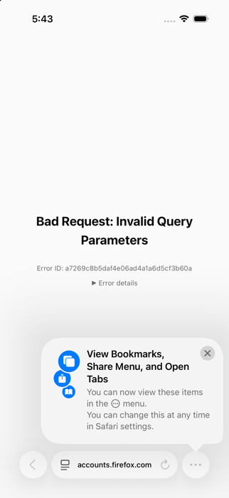

So the redirect has to be an `https:` URL, which is precisely what the system
sheet cannot intercept. Firefox for iOS has the same constraint with the same
client id and solves it the same way: run the flow in its own `WKWebView` and
watch for a navigation to `/oauth/success/<client id>?code=…`.

That is what this does, with the mitigations that are available: an
**ephemeral** data store, so no account cookie outlives the sheet and the
browser's own cookies are invisible to it; an **origin allow-list**, so a
redirect anywhere but Mozilla is refused rather than rendered; no injected
script and no message handler. The origin is printed along the bottom of the
sheet.

It is still weaker than the system sheet, because "we promise not to read the
field" is weaker than "we cannot". **The way to get that back is an OAuth
client id of Zen's own with a Zen scheme registered** — `usesSystemAuthSession`
and `redirectURI` in `SyncConfig.swift` are the only two lines that would
change. Worth a decision.

What *is* tested, and how: HKDF against RFC 5869's vectors, PKCE against
RFC 7636's, Hawk against the two vectors in its own specification, and the
BSO payload format against a vector generated with OpenSSL — so what that one
proves is that our padding, our base64-text HMAC and our hex casing agree with
a standard implementation byte for byte, not merely with themselves. Above
that, a whole sync runs in `SyncEndToEndTests` against an in-memory Sync 1.5
server that stores opaque payloads and never decrypts, which means every
assertion there went through our own encryption *and* our own decryption.

### Sync in Settings

| | |
|---|---|
| 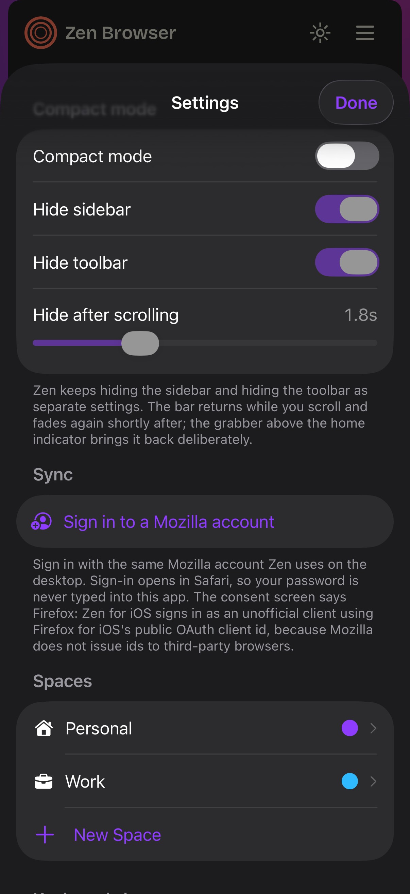 | 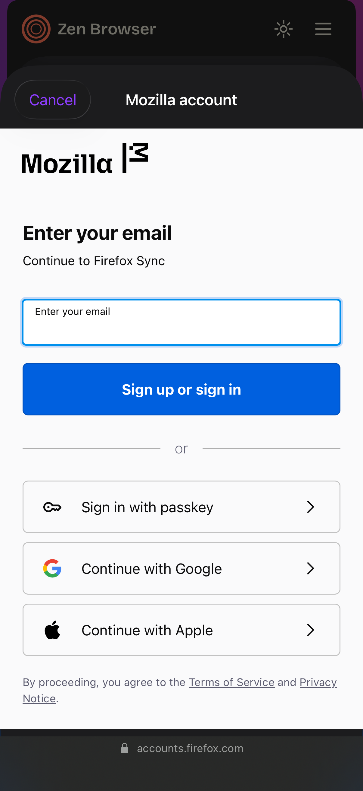 |
| Settings → Sync, signed out | The sign-in sheet on Mozilla's live server: the request is accepted and the real form loads |

### Deliberate divergences from upstream

| Upstream | Here | Why |
|---|---|---|
| Hover states everywhere | A haptic vocabulary | A finger produces no hover, so there is nothing to answer a touch that lands where the eye is not looking. The tap *is* the hover state. |
| Status bar always present | Hidden by default | In a browser the page is the app, and on a phone there is nowhere else for 60pt of clock to go. |
| Sidebar reached from a toolbar button | …or by swiping the URL bar | The button is a 34pt target at the far left of a six-inch screen — the one place a thumb holding the phone cannot reach. |
| New-tab row at the end of the tab list | A pinned full-width strip | The control you reach for most should not have to be scrolled to. |
| — | Address bar selects all on focus | SwiftUI's `TextField` cannot select its contents, so the address bar is a small `UITextField` wrapper. Without it, tapping the bar and typing *appends* to the current URL. |
| urlbar inline at the top | Floating pill at the *bottom* on iPhone | A phone is held one-handed; the top of a modern iPhone is not thumb-reachable. |
| Close shortcut default `switch` | Pinned/essential close = `reset-unload-switch` | Swiping a row away has to visibly do something. Essentials still cannot be destroyed, only demoted. |
| Chrome revealed on hover | Revealed by a grabber pill | No hover on a touch screen, and a bottom-edge tap loses every race with the iOS home gesture. |
| Invisible 5px splitter | 28pt hit area with a visible grab pill | A finger needs something to aim at. |
| Close button appears on row hover | Shown on the selected row; swipe otherwise | Same. |
| Glance: 80% wide, full height | 88% × 78%, centred | Full height on a phone is indistinguishable from just opening the tab. |
| `corner-shape: superellipse(1.3)` | `.continuous` rounded rectangles | SwiftUI has no superellipse corner shape. |
| Junicode serif wordmark | System serif | The font is not vendored. |

## Passwords

Zen keeps no passwords. On iOS it cannot usefully have any: there is no
browser-extension model, and an app cannot read another app's vault. What a
third-party browser gets — the same thing Firefox for iOS gets — is **system
Password AutoFill**. Focus a login field in a `WKWebView` and iOS puts a key in
the bar above the keyboard; whichever app is set as the AutoFill provider
(iCloud Passwords, 1Password, Bitwarden) is what answers.

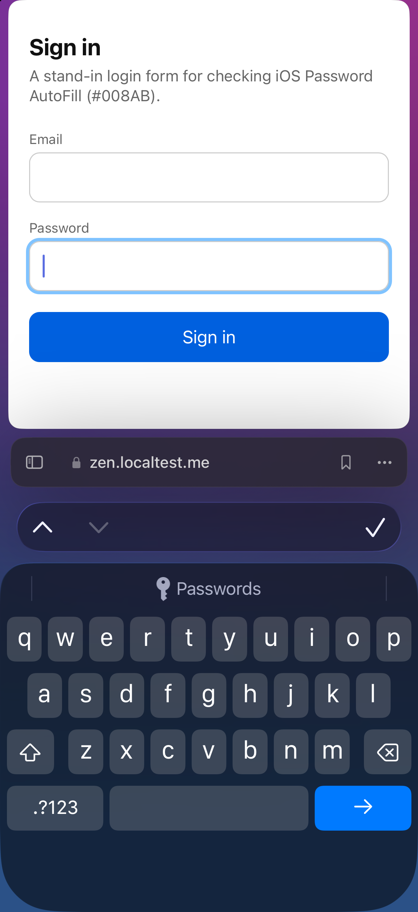

So the feature is not something to build, it is something **not to break**.
Every known way of losing that key is something the app does, and none of them
report an error — the key is simply not there:

| Do not | Why |
|---|---|
| Override `inputAccessoryView` on the web view | Replaces the bar iOS puts the key in |
| Empty `inputAssistantItem`'s bar button groups | Leaves the bar with nothing in it |
| Inject a user script that rewrites login forms | Renamed or re-parented fields stop iOS recognising the form |
| Add a script message handler that moves focus | AutoFill needs the field to keep first responder |
| Use a non-persistent (`.nonPersistent()`) store for browsing | Does not remove the key, but throws away whatever is then saved |

Zen does none of these, and `Tests/ZenTests/AutoFillSuppressionTests.swift`
pins each one — the two `inputAccessoryView`/`inputAssistantItem` cases by
comparing method implementation pointers against `WKWebView`, so an override
added anywhere in `ZenWebView` fails the test. The sign-in sheet
(`FxASignInWebView`) is the one web view that *does* inject a script and use a
non-persistent store; that is deliberate and scoped to Mozilla's own sign-in
page, which is not a page you fill from your vault.

**Settings → Passwords** explains the above and spells out the route to the
setting, because iOS publishes no URL for the AutoFill pane —
`UIApplication.openSettingsURLString` opens *Zen's* page, not that one. The
path is Settings → General → AutoFill & Passwords (on iOS 17 it was
Settings → Passwords → Password Options).

| | |
|---|---|
| 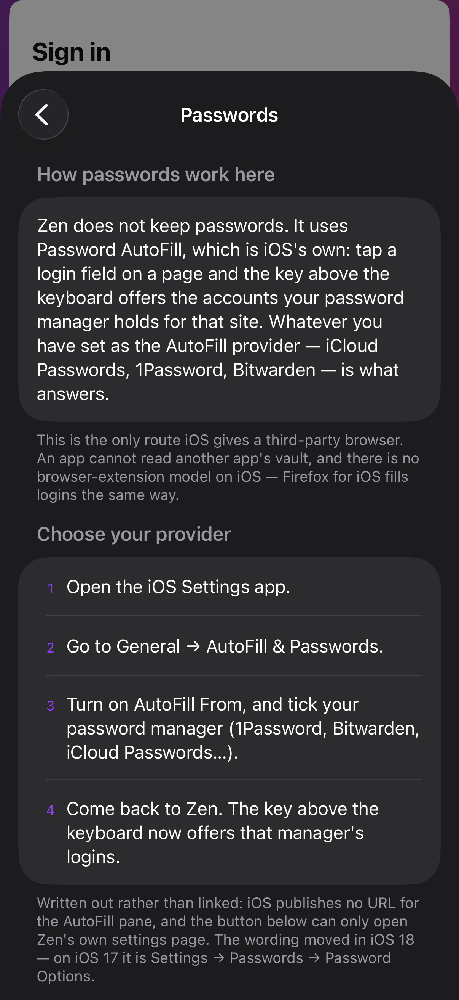 | 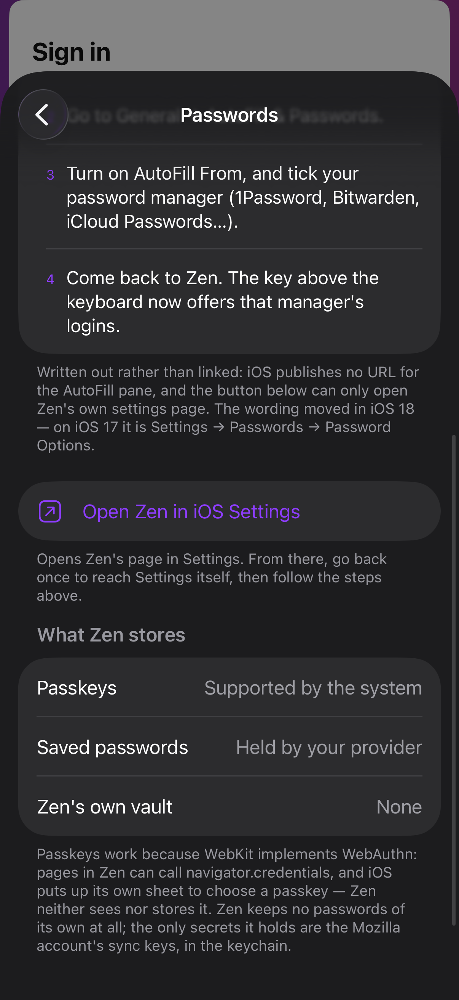 |
| How it works, and the four steps to choose a provider | What Zen stores — nothing — and the one button iOS allows |

**Passkeys** work, and are not ours either: WebKit implements WebAuthn, so a
page in Zen can call `navigator.credentials` and iOS puts up its own sheet.
`WebAuthnAvailabilityTests` asserts the API surface is exposed
(`navigator.credentials`, `window.PublicKeyCredential`) and *records* rather
than asserts `isUserVerifyingPlatformAuthenticatorAvailable()`, which answers
`false` in a simulator — there is no Secure Enclave and no saved passkey there,
so asserting it would be asserting a fact about the simulator.

### Checking AutoFill by hand

The end-to-end check needs a login page on a **secure origin**. This was
measured: served over `http://127.0.0.1:8090` the same page raises the keyboard
with *no* assistant bar above it at all, so plain http is not an option — iOS
offers AutoFill on https only.

`Tests/Fixtures/serve.py` serves `Tests/Fixtures/login.html` over TLS and makes
its own CA and leaf on first run. The host is `zen.localtest.me`, public DNS
that answers `127.0.0.1`, so nothing needs editing in `/etc/hosts`, and the
simulator shares the Mac's resolver and loopback.

```bash
python3 Tests/Fixtures/serve.py            # https://zen.localtest.me:8443/login.html
xcrun simctl keychain booted add-root-cert /tmp/zensync-fixtures/ca.pem
```

Then save a login for that site once (Safari in the same simulator will offer
to, after submitting the form), and run:

```bash
xcodebuild test -scheme ZenScreenshots -project Zen.xcodeproj \
  -destination 'platform=iOS Simulator,name=iPhone 17 Pro' \
  -derivedDataPath /tmp/zenbuild CODE_SIGNING_ALLOWED=NO \
  -only-testing:ZenUITests/ScreenshotTests/testPasswordAutoFillIsOfferedInTheWebView
```

The test asserts the bar is `SystemInputAssistantView` carrying a
`kb-autofill-key` — which is exactly what Safari shows on the same page, and
the comparison that makes the result mean something.

One catch worth knowing: **the keyboard cannot be screenshotted from inside the
test.** It lives in its own `UIRemoteKeyboardWindow`, and neither
`XCUIScreen.main.screenshot()` nor an element screenshot composites it — both
render the app window and leave a blank strip where the Passwords row is. The
committed `34-autofill.png` is a framebuffer grab taken while the test holds
the state:

```bash
xcrun simctl io booted screenshot frame.png
```


## Reader

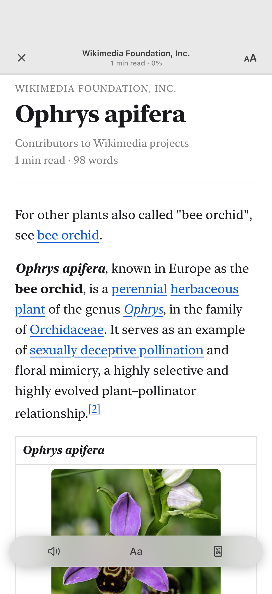

Safari's Reader is Safari's. WebKit exposes no reader or readability API to a
third-party app, so Zen does what Firefox for iOS and Zen desktop both do: it
runs **Mozilla's Readability.js** over the page and renders the result itself.
The library is vendored verbatim at `Sources/Reader/Readability.js`
(Apache-2.0), with its provenance in a header comment.

### Two libraries, because they cost different amounts

`Readability-readerable.js` is about 4 KB and answers "does this look like an
article?" without parsing anything. That is cheap enough to ask of every page
that finishes loading, which is what lets the reader button *appear by itself*
next to the address instead of being a menu item that usually disappoints.

`Readability.js` is about 90 KB and rewrites a clone of the document. That is
not something to do on every page load, so it is evaluated only when the reader
is actually opened, and cached on `window` so a second opening of the same page
costs one function call. It runs on `document.cloneNode(true)` — Readability
mutates what it is given, and gutting the live page would leave nothing to go
back to.

**Neither is a user script**, and that is the load-bearing part (#008AB). A
`WKUserScript` runs in every page, including the one you type a password into,
and one that touches login markup stops iOS recognising the fields — Password
AutoFill then goes quiet with no error to explain it. Both scripts are
`evaluateJavaScript` into the isolated `.defaultClient` content world, on
demand. `ReaderExtractionTests` pins that the browsing configuration still
carries exactly one user script, the media observer.

### The controls

| | |
|---|---|
| 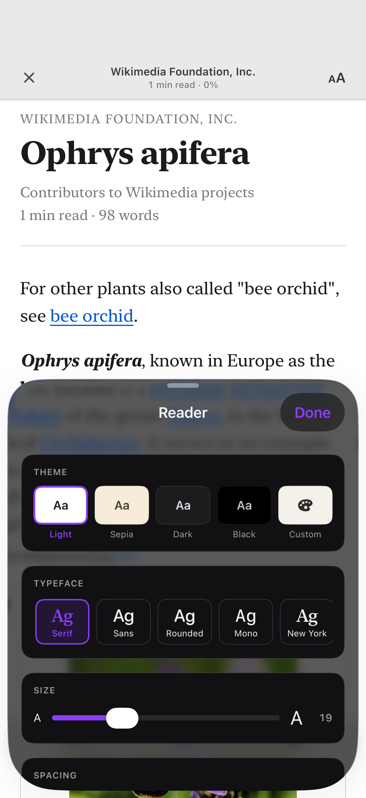 | 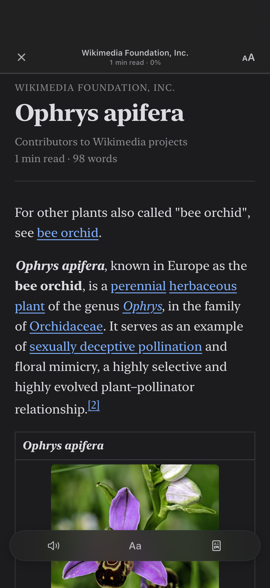 |
| The panel at its medium detent — the article stays live above it | Dark, one of five themes |
| 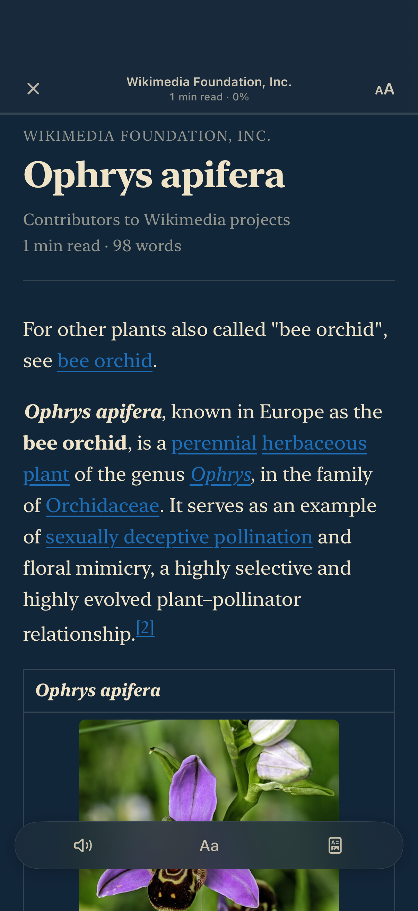 | 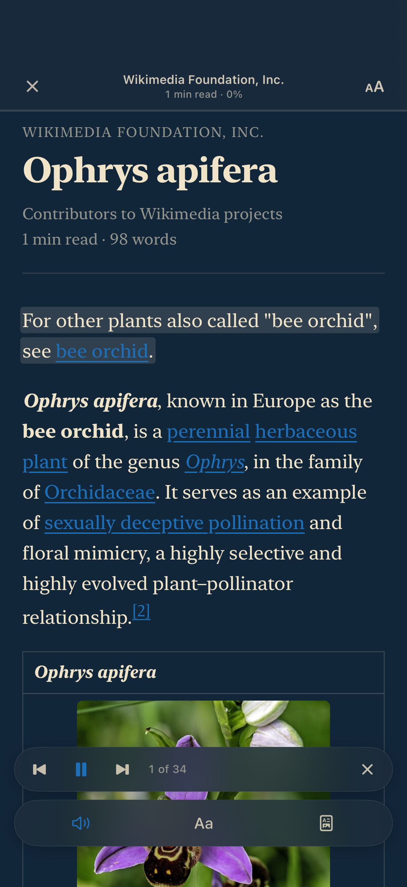 |
| Custom: background, text and link colours picked with #0088F's colour tool | Read aloud, with the sentence being spoken highlighted |

Nine typefaces, size, line height, letter spacing, paragraph gap, three column
widths plus a measure slider, left or justified with hyphenation, an in-reader
dim, images on or off, a drop cap, reading progress and estimated time, and the
speech rate. Five themes — light, sepia, dark, true black, and a custom one
whose background, text and link colours go through the same wheel, brightness
track, HSB/RGB sliders and validated hex entry that pick a space accent.

Every control is a **CSS custom property** or a class on `<html>`, set through
one `evaluateJavaScript`. Nothing reloads, because a reload loses your place in
a long article and an appearance control that scrolls you back to the top is
one you use once. The initial document and the live update are generated from
the same function, so the two cannot drift.

The panel is a sheet at `.medium` with `presentationBackgroundInteraction`
enabled. That property is most of the difference between a control panel and a
preferences screen: the article stays visible and live above the sheet, so
dragging the size slider is something you watch happen.

### Per-site memory

| | |
|---|---|
| 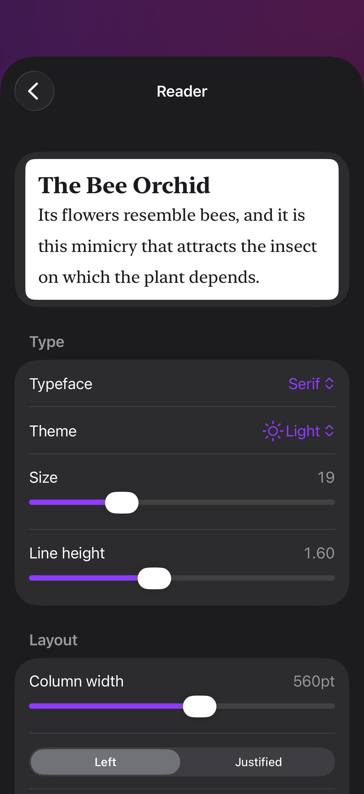 | 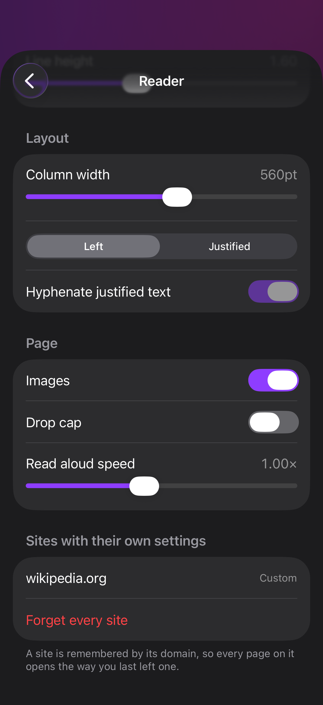 |
| Settings → Reader: the defaults, previewed on type rather than described | The sites that have since disagreed, and the one button that forgets them |

The point of a reader's controls is that you set them once, and setting them
once *globally* is not enough — a site whose own type is small is a standing
exception. So the lookup is two-level: an override per **registrable domain**
falling back to the global default in Settings → Reader. It follows the same
convention `PageZoom` uses for text size (#008B7): its own small JSON document,
a short public-suffix table rather than the whole list, and a bare IP or
single-label homelab host as its own key.

### Judgement calls

- **No fonts are bundled.** Every face on offer is already on the device: the
  four system families plus the book faces Apple ships (Georgia, Palatino,
  Charter, Avenir Next, New York). Vendoring web fonts would cost a megabyte, a
  licence review and a second rendering path, and would buy a reader nothing
  they cannot already get.
- **The read-aloud highlight is drawn, not inserted.** Marking the spoken
  sentence with a `<mark>` needs `Range.surroundContents`, which throws the
  moment a sentence crosses an inline element — and a sentence containing a
  link is most of them. So the highlight is a set of absolutely positioned
  rectangles taken from `Range.getClientRects()`, painted behind the text.
  Nothing in the article moves.
- **The synthesizer gets one sentence at a time.** One utterance per sentence,
  the next enqueued only when the last finishes. That costs a barely
  perceptible beat between sentences and buys an exactly known current
  sentence — so the highlight cannot drift — and a skip that is "stop and start
  the next one" rather than queue surgery.
- **Sentence offsets are UTF-16**, because that is what a JavaScript string
  index counts. The reader page hands Swift its own flattened text index and
  the chunking happens over that, so an offset pair always maps back onto a
  real DOM range. One emoji before the text would otherwise put every later
  highlight a character out, silently.
- **Leaving the reader is removing a layer.** The reader is a second
  `WKWebView` over the page, not a takeover of it, so the article's own web
  view is untouched underneath — same scroll offset, same history. There is no
  position to restore and so nothing that can fail to.

### Not done here

- **The probe is Mozilla's heuristic, and it is a heuristic.** It says no to
  pages that read perfectly well in the reader, which is why *Show Reader* is
  in the overflow menu as well as on the bar.
- **Cross-origin `<iframe>` content is out of reach**, as it is for everything
  else a script can see.
- **No "reader by default for this site".** The per-site memory remembers how
  an article looks, not whether to open the reader automatically.

## Screenshots

| | |
|---|---|
| 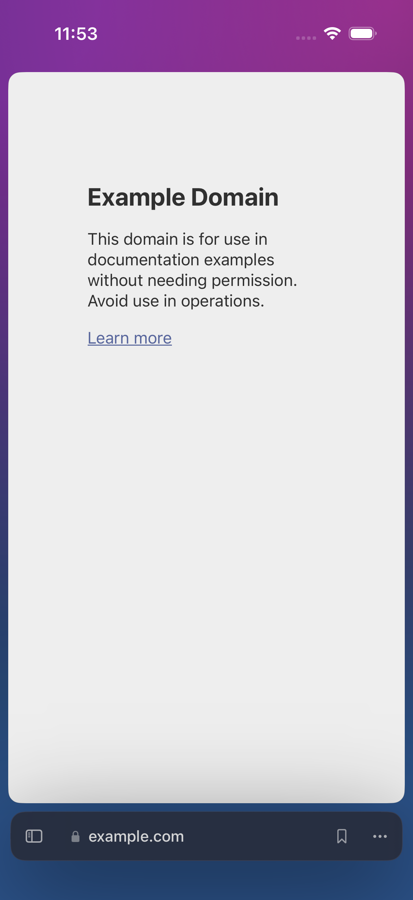 | 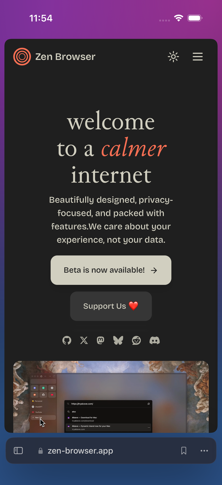 |
| A loaded page, the space gradient framing the content | A second page in the same space |
| 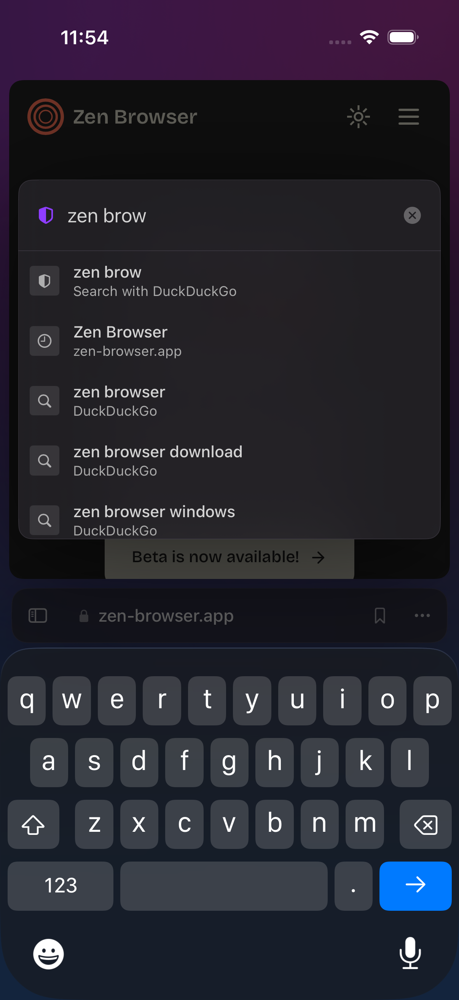 | 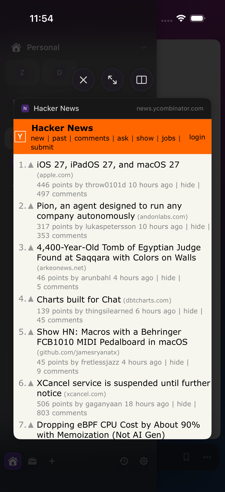 |
| The centered floating search box with suggestions | Glance: a link as a card over the dimmed page |
| 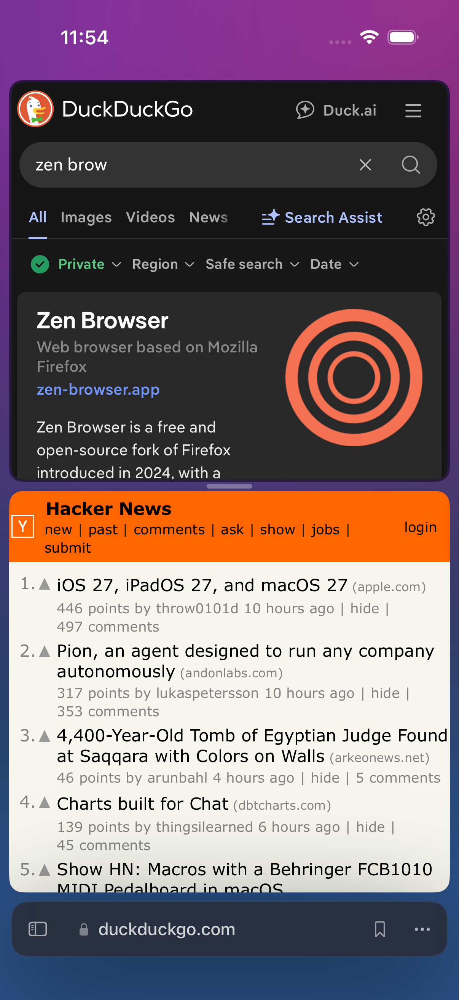 | 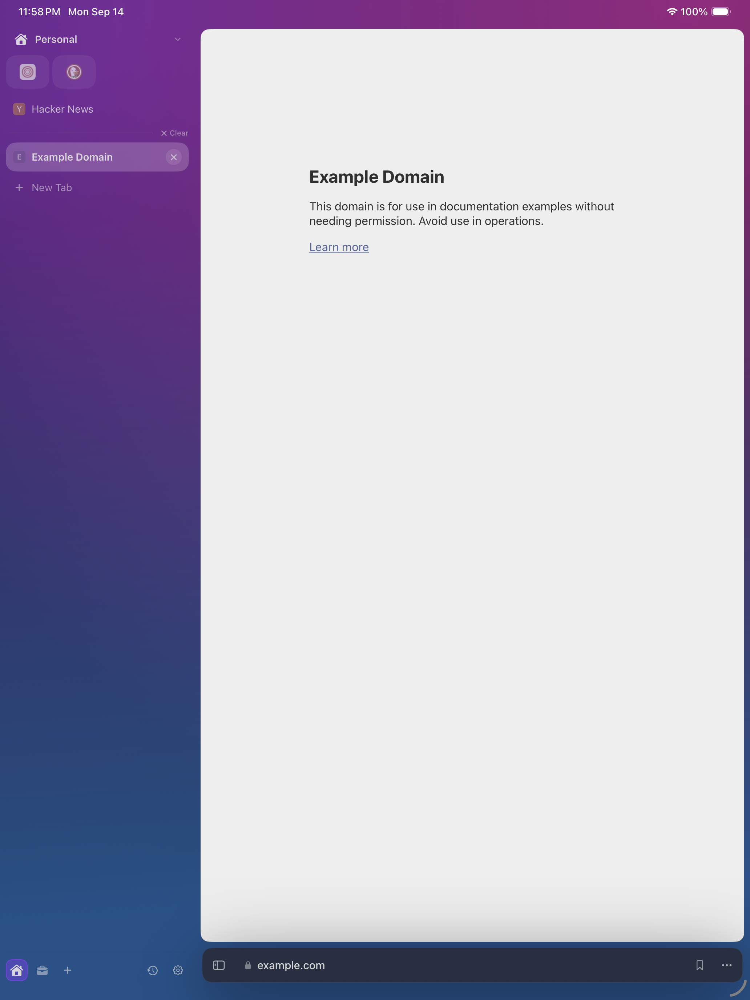 |
| Split view with a draggable divider (stacked in portrait, side by side when wide) | The persistent sidebar on iPad |
| 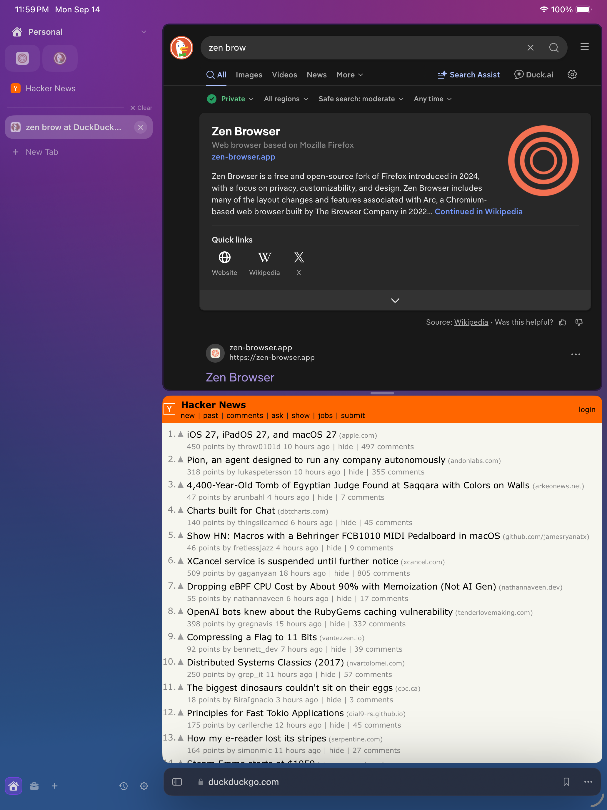 | 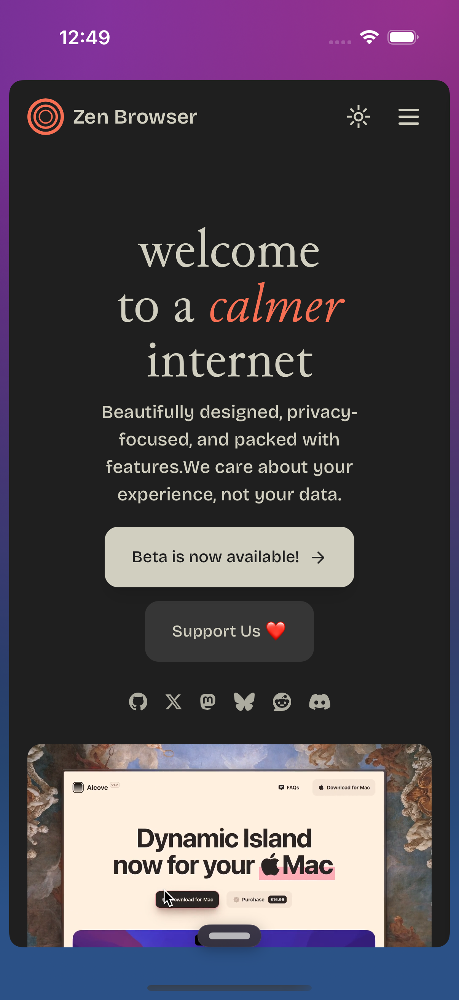 |
| Split view on iPad, where the panes sit side by side | Compact mode: the bar is gone, the grabber remains |

### When a page will not load

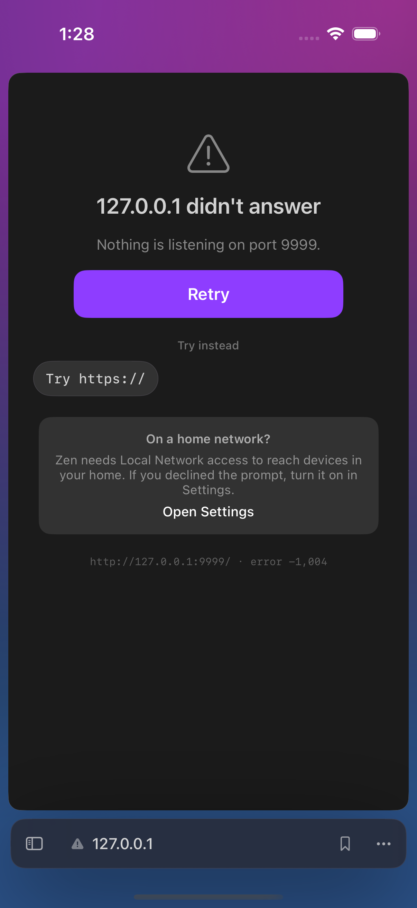

A failed load used to leave a blank page and an untappable warning glyph. It
now explains itself: host, port, reason, the underlying error code in small
text, Retry, the other scheme, and — when the default port was refused — the
ports homelab services actually sit on (8006 for Proxmox, 8080, 8443, …).
LAN addresses also get the Local Network permission hint, because a declined
prompt fails every connection afterwards with no visible cause.

### The status bar, and the new-tab strip

| | |
|---|---|
| 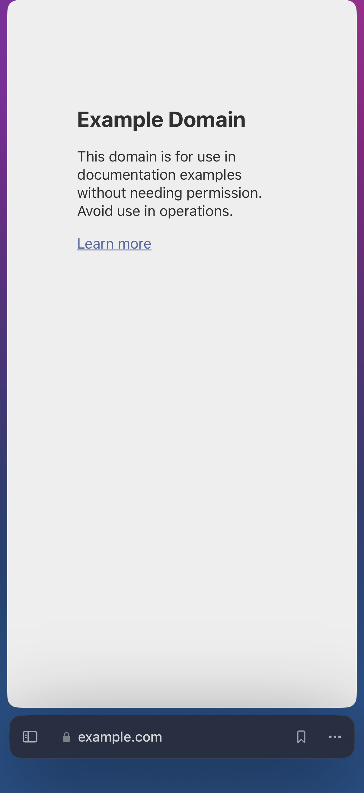 | 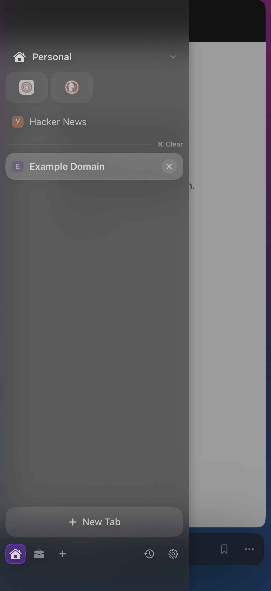 |
| Hidden by default, so the page runs to the very top edge | New Tab as a pinned full-width strip, not a row that scrolls away |

### The colour tool

| | |
|---|---|
| 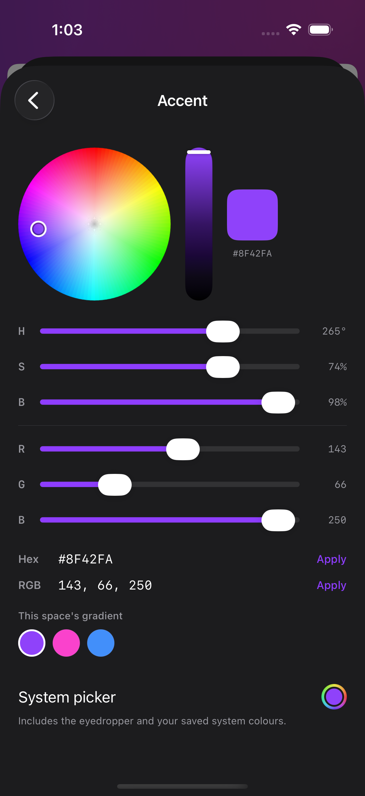 | 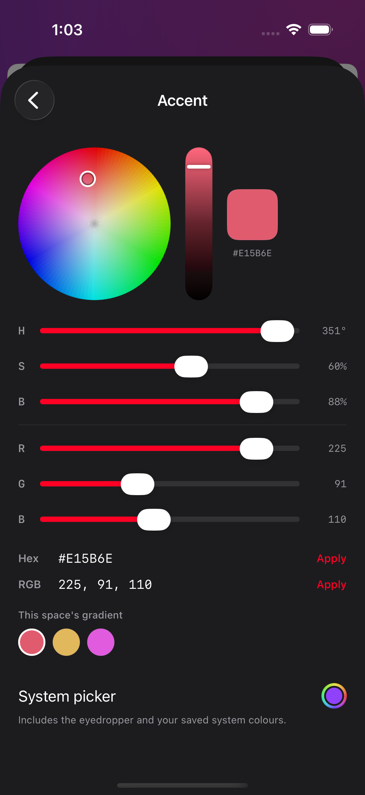 |
| Wheel, brightness track, HSB/RGB sliders, recents | Typed hex, validated and applied |


## Licence

Zen is MPL-2.0; this directory follows the repository's licence.
