# Zen for iOS

Zen Browser's interface, rebuilt natively on WebKit.


> **This is the `experimental` branch.** It carries the features desktop Zen
> does not have — see [Experimental additions](#experimental-additions). The
> `ios` branch is the faithful translation of Zen desktop only, and its README
> does not mention anything on this page.

## Why this is not Gecko

Desktop Zen is a Firefox fork, so it renders with Gecko. Neither half of that
travels to iOS:

- **Apple requires WebKit.** Outside the EU, App Store guideline 2.5.6 still
  requires every browser to render with WKWebView. The alternative-engine
  entitlement introduced for the DMA is EU-only and needs a separate binary,
  a developer account in good standing and an Apple-approved engine — Gecko is
  not one.
- **Gecko has no iOS target.** There is no `--target=ios` in mozilla-central.
  Mozilla ship Firefox for iOS as a WKWebView shell for exactly this reason.

So this app does not try to port the engine. It ports the *browser* — the part
people actually choose Zen for. Spaces, vertical tabs, essentials, glance,
split view and compact mode are interface ideas, and interface ideas port fine.

Everything visual is derived from Zen's own source rather than eyeballed from
screenshots: the palette is a line-by-line port of `zen-theme.css`'s
`color-mix()` chain, the gradients follow `ZenGradientGenerator.mjs`, and the
metrics in `ZenMetrics.swift` are quoted from Zen's stylesheets with the
touch-sized deviations noted inline.

## Build and run

Requires **Xcode 27.0** (build 27A266a) and **xcodegen 2.46.0**
(`brew install xcodegen`). Deployment target iOS 17.0; iPhone and iPad.

```bash
cd ios
xcodegen generate
open Zen.xcodeproj          # or build from the command line:

xcodebuild build -scheme Zen -project Zen.xcodeproj \
  -destination 'generic/platform=iOS Simulator' \
  -derivedDataPath /tmp/zenbuild CODE_SIGNING_ALLOWED=NO

xcodebuild test -scheme Zen -project Zen.xcodeproj \
  -destination 'platform=iOS Simulator,name=iPhone 17' \
  -derivedDataPath /tmp/zenbuild CODE_SIGNING_ALLOWED=NO
```

`Zen.xcodeproj` is committed alongside `project.yml` so the repo is clonable
without xcodegen, but `project.yml` is the source of truth — regenerate after
adding files.

There are **no third-party Swift dependencies**: SwiftUI, WebKit and Foundation
only. There is exactly one vendored third-party file — Mozilla's
**Readability.js** (Apache-2.0), which reader mode runs in the page, as Firefox
and Zen desktop do. It is checked in verbatim at `Sources/Reader/`, with its
provenance in a header comment; there is no package manager involved.

### Screenshots

The images in this README are produced by a separate scheme that drives the app
through each state and writes PNGs into the UI-test runner's container:

```bash
xcodebuild test -scheme ZenScreenshots -project Zen.xcodeproj \
  -destination 'platform=iOS Simulator,name=iPhone 17' \
  -derivedDataPath /tmp/zenbuild CODE_SIGNING_ALLOWED=NO
cp "$(xcrun simctl get_app_container booted com.morton.zen.uitests.xctrunner data)/Documents/"*.png \
  docs/screenshots/
```

It is deliberately *not* part of `-scheme Zen`'s test action: it needs the
network and takes minutes, where the unit tests take under a second.

## Experimental additions

Everything in this section is **not a port of a Zen desktop feature**. These
are ideas that only make sense on a phone, that a homelab makes necessary, or
that Zen has never had:

| Ticket | Addition | What it is |
|---|---|---|
| **#00887** | Layout cycle | Three states — card, edge to edge, full screen — cycled from the overflow menu or ⇧⌘F. Desktop chrome always frames the content; a phone screen is small enough that the frame is a real cost. |
| **#00888** | Focus mode | An ephemeral private session modelled on the Firefox Focus app: its own `WKWebsiteDataStore.nonPersistent()`, nothing written to history or session restore, tracker/ad blocking via a compiled `WKContentRuleList`, third-party cookies blocked, a prominent Erase button, and a purple theme so the mode is unmistakable. Optionally locked behind Face ID on return from the background. |
| **#00889** | LAN certificate approval | A calm, specific prompt for self-signed certificates on home-network hosts, instead of the same red interstitial a public site gets. Approvals are remembered per host *and* SHA-256 fingerprint; a changed certificate re-prompts. |
| **#00891** | Floating bar fill | Liquid Glass / Matte / Transparent, default Liquid Glass. The full-screen layout floats the bar with no backing material, which is gorgeous over a dark page and invisible over a light one — so the backing became a choice rather than a guess. |
| **#0089A** | Security badge | The warning glyph in the URL pill is a button: it reopens a waiting certificate prompt, shows an approved certificate's record and fingerprint (with a way to forget it), explains a plain-HTTP connection, or details a failed load. |
| **#0089B** | Scheme prefill | Typing `10.`, `192.` or `172.` fills in `https://` as ordinary editable text. Narrowly scoped: whole field only, typed not pasted, and never again in the same edit once you delete it. |
| **#0088F** | Named colours & code lookup | A searchable CSS/X11 + curated swatch library in the colour tool, plus a code search over a palette JSON you import yourself. No licensed colour system is bundled — see below. |
| **#00890** | Sepia | A third palette base (paper `#F4ECD8` over ink `#5B4636`) run through zen-theme.css's own `color-mix` chain, plus an off-by-default page tint. |
| **#00896** | Customisable bar | One persisted `BarLayout` describes the whole URL bar — where it sits, how big it is, what is inside the pill, which buttons it carries, what its gestures do and when it hides. Four presets, ones you save, and JSON import/export. |
| **#008B7** | Text size | Safari's `AA` row — smaller and larger side by side in the More menu, with the percentage between them — on `WKWebView.pageZoom`, remembered per registrable domain, with a global default in Settings and ⌘+ / ⌘− / ⌘0 on iPad. |
| **#008B9** | Navigation helper | Page up, page down, top and bottom as four minimal round buttons that fade in while the page is scrolling and fade out once it settles. Off by default; they take the edge opposite the sidebar, never the first scroll gesture, and step by one *visible* screenful less a small overlap. |
| **#008BA** | Two-line stacked bar | `Rows: 1 / 2` in Customize bar. Two puts the address on its own line and the buttons on a full-width row below it, raising a side from four glyphs to seven; landscape can collapse it back. |
| **#008BB** | Per-workspace display | A space can override the layout, appearance, bar layout and fill, compact mode, sidebar edge, text size and the navigation helper. Everything else inherits, and keeps inheriting when the global changes. |
| **#008B8** | Browser extensions | Firefox/Chrome WebExtension packages loaded by WebKit's `WKWebExtension` (iOS 18.4+). Install from Files, the Share sheet or a pasted addons.mozilla.org link; a compatibility scan says up front which of the APIs the package uses WebKit does not have. One extension controller per space, so an extension's storage is isolated exactly as a site's cookies are — and none in Focus. |
| **#0089C** | LAN scanner & Local | Settings scans the subnet this device is on, finds what is listening, reads page titles and certificate fingerprints, and keeps the ones you pick under aliases the address bar understands. |

Everything else in this README is shared with `ios`.

### Why there is no Pantone

Pantone, RAL and NCS values are licensed. Shipping a table of approximations
under those names would be both a licence problem and a lie about colour
accuracy — the whole value of a colour system is that the number is exact.

So the colour tool's **code lookup** searches a palette file you supply
instead. The note saying so sits next to the field in the app, not only here,
because it explains why the control has the shape it does. See
[Importing a palette](#importing-a-palette-for-the-code-lookup).

### The Focus blocklist — provenance

`Resources/Blocklist/focus-blocklist.json` is a **starter list, not a complete
one**. It is roughly 200 hand-picked domains that appear across the public
lists — EasyList, EasyPrivacy and Disconnect.me's tracker categories — chosen
for breadth of coverage per entry rather than exhaustiveness: the large ad
exchanges, the analytics and session-replay vendors, the identity brokers and
the mobile attribution SDKs. It is compiled by WebKit into a rule list, so the
app never sees the requests it blocks.

It is deliberately *not* a maintained feed. A real deployment should pull a
current list on a schedule; a few hundred static entries will drift, and a
tracker not in the file is not blocked. The final rule blocks third-party
cookies outright, scoped to third-party loads so first-party logins survive.

## Feature matrix

| # | Feature | State | Notes |
|---|---------|-------|-------|
| 1 | **Spaces** — named, icon, gradient theme | Done | Emoji or SF Symbol icon. Each space gets its own `WKWebsiteDataStore(forIdentifier:)`, so cookies and logins are isolated per space. |
| 1 | Space swipe to switch | Done | Horizontal drag on the sidebar translates the list live, then springs, as `ZenSpacesSwipe` does. |
| 1 | Space switcher strip | Done | Along the sidebar bottom, each chip previewing its own accent. |
| 2 | **Vertical tab sidebar** | Done | Slide-in drawer on iPhone (edge swipe or toolbar button), persistent on iPad. |
| 2 | Sidebar edge (#008A8) | Done | Settings → Sidebar position: Left / Right, as Zen desktop's own `sidebar.position` allows. Moves the drawer/persistent sidebar and its edge-swipe reveal, and mirrors whichever bar gesture slot is bound to `.sidebar`. Animated, with a haptic on toggle. Where the sidebar *button* sits is the Customize bar editor's call — #00896's slot system already lets it go on either side, so this does not fight that; it is a hard-wired mirror only where there is no slot system, i.e. the `ios` branch. |
| 2 | Swipe to close a tab row | Done | Pull left past the threshold, with a haptic at the threshold itself. |
| 2 | Swipe the URL bar to the sidebar | Done | Right or up on the bar opens the drawer, left or down closes it (#0089F). The direction → action map is a table, so the planned URL-bar customisation can reassign it. |
| 2 | New Tab strip | Done | Full-width, 44pt, pinned below the tab list rather than scrolling away inside it (#0089F). |
| 2 | Reorder by drag | Partial | Essentials reorder by drag. Pinned and normal rows reorder through the model (`moveTab`) but have no drag gesture wired up yet. |
| 2 | Unloaded tabs | Done | An LRU pool keeps at most six live `WKWebView`s; the rest keep URL, title, favicon and scroll offset and reload on selection. Unloaded rows render dimmed and desaturated. |
| 3 | **Essentials** — global pinned grid | Done | Four across, favicon-only tiles, shared across every space, capped at 12 as upstream is. |
| 3 | Per-space pinned tabs | Done | Above the separator; closing one resets it to its pinned URL instead of destroying it. |
| 3 | Separator with clear affordance | Done | |
| 4 | **Omnibox** — floating bottom pill | Done | At the bottom on iPhone for thumb reach; upstream's is inline at the top. |
| 4 | Centered floating search box | Done | 62px, 12px radius, the large soft shadow, 252px result list. |
| 4 | Suggestions | Done | History (frecency-ranked), engine autocomplete, and a subset of Zen's urlbar global actions. |
| 4 | URL vs search detection | Done | Covered by tests, including `localhost`, bare IPs, `IP:port`, `.lan`, and refusing `javascript:`. |
| 4 | Single-word input | Done | A *bare* word (`meitner`) still searches — it is indistinguishable from `swift` — but the omnibox offers the other reading explicitly as the second row, "Go to http://meitner". Once the host is in history the default flips: the top hit navigates and *searching* becomes the second row. |
| — | **Load failures** | Done | A real error page with host, port, reason, error code, Retry, scheme flip, common-port suggestions and a Local Network hint. 10s timeout with a watchdog for addresses that neither answer nor fail. |
| 4 | Search engine choice | Done | DuckDuckGo (default), Google, Bing, Startpage, Ecosia. Startpage has no public autocomplete endpoint and borrows DuckDuckGo's. |
| 4 | Desktop/mobile user agent | Done | Global setting; applied per web view at creation. |
| — | **Haptics** (#00897) | Done | One service, one semantic-event table, four levels (Off / Subtle / Normal / Rich, default Normal). Impacts, selection ticks and notifications for ~30 moments, plus Core Haptics patterns for three. Never during a scroll, never backgrounded, never twice for one action. Tested through a recording backend. |
| — | **Video and pop-out** (#008B0) | Done | Inline playback, element full screen, AirPlay and Picture in Picture are all enabled in one place (`WebEngine.applyMediaPolicy`), and a page decides for itself when to start playing — `mediaTypesRequiringUserActionForPlayback` was `.audio`, which reads as the polite setting and in fact breaks muted autoplay. `UIBackgroundModes: audio` plus an `AVAudioSession` in `.playback`/`.moviePlayback` keep media going when backgrounded or locked; the session is claimed on the first page that plays and released by the last, never at launch. **Pop out video** in the overflow and page context menus picks the page's most relevant `<video>` — playing first, then largest visible — and asks for PiP. Cross-origin `<iframe>` embeds are out of reach; YouTube's mobile site is same-origin and works. **The iOS Simulator has no Picture in Picture at all** (`document.pictureInPictureEnabled` is false), so the request is gated on `webkitSupportsPresentationMode` rather than on the method existing — otherwise it reports success for a call that silently does nothing — and the floating window itself can only be verified on hardware. |
| — | **Hidden status bar** (#00899, #008A9) | Done | Off by default with a Settings toggle. It takes away the clock, the signal and the battery — and nothing else. The Dynamic Island is hardware, iOS still reports a top safe-area inset for it, and the content card still starts below that inset; the setting is not an input to the layout at all (`PageTopInsets`). |
| 5 | **Compact mode** (#008AF) | Done | Keeps Zen's two independent toggles (hide sidebar / hide toolbar), persisted. Three bar states rather than two: the full bar falls to a **pill** — favicon and domain, nothing else — once the page has been still for the hide delay (3 s by default), and then to nothing. Scrolling brings back the pill and only the pill; a **tap** on the pill is the one thing that expands the full bar. Swiping up from either opens the tab drawer, alongside the existing swipe right. |
| 5 | Reveal | Done | A drag-handle grabber above the home indicator (36×6pt pill, 44pt hit area): tap or pull up to reveal, tap the page or scroll to hide. Upstream reveals on *hover* within 10px of an edge; the touch translation of that sat on top of the iOS home gesture and lost, so it is an explicit target instead. |
| — | **Layout cycle** | Done | Three states cycled from the overflow menu or ⇧⌘F, persisted: **card** (Zen's inset frame), **edge to edge** (page to the very top, bar in flow), **full screen** (page everywhere, bar floating with no backing material). The web view's scroll insets and scroll-to-top follow the state. |
| 6 | **Split view** — two panes | Done | Side by side when wide (iPad, landscape iPhone), stacked when tall. Draggable divider with the same 7%-of-parent minimum. Focused pane gets the 2px accent outline. |
| 6 | 3–4 panes, grid/hsep layouts | **TODO** | Upstream's `MAX_TABS = 4` with a nested split tree. The model holds one secondary pane; extending it means replacing `splitSecondaryTabID` with a node tree. |
| 7 | **Glance** | Done | Long-press a link → "Open in Glance", or from a tab row's context menu. Card over a dimmed page with close / expand-to-tab / split-out. |
| 7 | Arc open/close animation | Partial | Upstream animates the card along an 80-step arc from the clicked element, with an `easeOutBack` overshoot and a snapshot of the source element. We use a spring scale-and-fade from centre. |
| 7 | Drag to dismiss | Done | An addition, not a port — upstream has a cursor and does not need one. |
| 8 | **Session restore** | Done | Spaces, tabs, tier, active tab per space, scroll offset and settings, as JSON in Application Support. Written through `replaceItemAt`, so a jetsam mid-write cannot truncate it. Snapshots are sanitised on load. |
| 9 | **History** with search | Done | JSON, capped at 5,000 entries, frecency-ish ranking. |
| 9 | **Bookmarks** | Done | Toggle in the omnibox pill; managed from the same sheet as history. |
| 10 | **Theme** — light/dark + Zen tokens | Done | Follows the system unless a themed space overrides it, which is what upstream's `shouldBeDarkMode()` does. |
| 10 | Per-space accent picker | Done | Swatches plus a harmony picker; the other dots derive from the same hue offsets the desktop wheel snaps to. |
| 10 | **Colour tool** | Done | A real accent picker: a Canvas hue/saturation wheel with a separate brightness track, HSB and RGB sliders with live numeric readouts, and hex / RGB-triplet entry validated with specific errors. Recent colours and the space's own gradient stops are one-tap targets; the system `ColorPicker` is offered as a secondary route for the eyedropper. Every path writes the same `ZenColor`, so the zen-theme.css derivations are unchanged. |
| 10 | **Appearance** | Done | Follow System / Light / Dark, matching Zen's `zen.view.window.scheme`. An explicit choice overrides a space's `shouldBeDarkMode()` contrast heuristic; Follow System lets it apply. |
| 10 | Film grain | Partial | A generated noise tile at `.overlay` blend. Upstream ships `grain-bg.png` at `mix-blend-mode: hard-light`, which SwiftUI has no equivalent for. |
| 11 | **Keyboard shortcuts** | Done | ⌘T, ⌘W, ⌘L, ⌃Tab / ⌃⇧Tab, ⇧⌘S, ⇧⌘E, plus ⌘F, ⇧⌘F (layout) and ⌃⇧← / ⌃⇧→. Each fires a selection tick, because a hardware keyboard gives no other confirmation the chord was caught. |
| 12 | **Share sheet** | Done | From the omnibox overflow menu. |
| 12 | **Find in page** | Partial | Uses WKWebView's `find(_:configuration:)`. `WKFindResult` reports only found/not-found, so there is no "3 of 12" counter. |
| 13 | **Firefox Sync** — Mozilla account | Done | OAuth + PKCE with scoped-keys delivery: an ephemeral P-256 key goes up as `keys_jwk`, the returned `keys_jwe` comes back down as the oldsync key. Mozilla's server accepts the request and serves the sign-in form; **no sign-in has been completed** — see *Sync: first run*. |
| 13 | Token server and Hawk | Done | `token.services.mozilla.com/1.0/sync/1.5` with `X-KeyID`, then Hawk on every storage request. Checked against the Hawk specification's own vectors. |
| 13 | Sync 1.5 storage | Done | `info/collections`, `meta/global`, `crypto/keys`, `X-If-Unmodified-Since` on every write, the batch protocol past 100 records or 1 MB, offset paging, backoff. |
| 13 | **Zen spaces engine** | Done | Zen's own `spaces` collection at engine version 3, in the desktop's record schema — space, tab and layout records, with containers, folders and split groups held rather than deleted. |
| 13 | Bookmarks | Partial | Leaf-level, into Mobile Bookmarks. Desktop folders are held, and their contents appear here unfiled — Zen for iOS has no bookmark folders to put them in. |
| 13 | Open tabs | Done | Ours published; other devices' shown in the sidebar under "Other devices", tap to open here. |
| 13 | History | Done | Additive merge — last-writer-wins on history would delete evidence of a visit. |
| 14 | **Passwords** — iOS Password AutoFill | Done | Not a feature so much as a suppression audit: no custom `inputAccessoryView`, no emptied `inputAssistantItem`, no user scripts in page content, persistent per-space stores. Verified in the simulator against a local https fixture, showing the same `SystemInputAssistantView` / `kb-autofill-key` Safari shows. See *Passwords*. |
| 14 | Passkeys (WebAuthn) | Done | WebKit's own; Zen neither sees nor stores them. The platform authenticator answers `false` in a simulator. |
| 14 | A password manager of Zen's own | **Not on this branch** | iOS gives a third-party browser no way to be one for other apps. A native 1Password Connect / Vaultwarden panel *inside* Zen is being tried on `experimental` (#008AD). |
| — | **Focus mode** (#00888) | Done | Ephemeral space on a non-persistent data store, no history or session writes, compiled blocklist, third-party cookies blocked, Erase button + toast, purple theme. ⇧⌘P or the overflow menu. |
| — | Focus: Face ID lock | Partial | Locks on return from the background when enabled in Settings. Fails *open* where no authentication is configured — the simulator cannot do biometrics, so this path is exercised only as "unavailable → do not lock". |
| — | **LAN certificates** (#00889) | Done | Friendly prompt for local hosts with homelab-shaped TLS failures; stern flow otherwise. Trusted list in Settings with swipe-to-forget. |
| — | **Security badge** (#0089A) | Done | The pill's glyph is a button. Precedence: a failed load outranks everything, a waiting TLS prompt outranks the padlock, an approved self-signed certificate reads as approved rather than as a warning. Presented from the root so it covers a split pane or a glance card, and *queued* behind any other sheet rather than silently dropped. |
| — | **Bar fill** (#00891) | Done | Liquid Glass / Matte / Transparent, default Liquid Glass. Glass is `glassEffect(.regular, in: Capsule())` in a `GlassEffectContainer`, `.interactive()`, tinted 50% with the chrome surface so palette-coloured glyphs keep their contrast. iOS 26+; `.ultraThinMaterial` below. Covers the compact bar and the split-pane bars. |
| — | **Scheme prefill** (#0089B) | Done | `10.` / `192.` / `172.` gain `https://`. Whole field only, typed not pasted, never over an existing scheme, and never again in the same edit once deleted. |
| — | **Named colours** (#0088F) | Done | CSS/X11 plus a curated set, ranked exact → prefix → substring; a pasted hex flips it into a value lookup. |
| — | **Code lookup** (#0088F) | Done | Searches a palette JSON you import through the Files picker. Nothing licensed is bundled. |
| — | **Sepia** (#00890) | Done | A third `ZenSurfaceBase` — paper over ink — through the same `color-mix` chain, so the accent still drives every token. Optional off-by-default page tint, as an overlay rather than a root `filter:` so `position: fixed` keeps working. |
| — | **Customisable bar** (#00896) | Done | Position (floating / bottom / top), height, corner radius, margins, offset, pill or full width; fill, custom colour, blur strength, border, shadow, URL text size, accent source, haptics; favicon, security badge, label style, progress style, find button; left / right / overflow slots filled by drag-and-drop from an action library, each with an optional long-press action; six assignable gestures; three auto-hide rules with landscape overrides; four presets plus your own; JSON import and export. |
| — | **Bar progress** (#00896) | Done | `estimatedProgress`, `isLoading`, `canGoBack` and `canGoForward` observed off the web view rather than polled, so back / forward / reload-stop and the progress indicator are live per pane. |
| — | **LAN scanner** (#0089C) | Done | Two-phase sweep of the device's own subnet (capped at /22), Bonjour and reverse DNS alongside, `<title>` and leaf-certificate capture on web ports. Progress, cancel, custom ports, opt-in 1–1024. |
| — | **Local services** (#0089C) | Done | Imported services with editable aliases, notes and last-seen, grouped by host. A third segment beside History and Bookmarks, its own sheet from the bar, omnibox suggestions, and a bare alias that navigates. |
| — | **Trust certificates** (#0089C) | Done | One button approves the certificates the imported HTTPS services are currently serving, and shows exactly what it approved. A host that later serves a different one still re-prompts. |
| 12 | **Reader mode** | **TODO** | WebKit exposes no reader/readability API to third-party apps. Implementing it means injecting a Readability port and rendering the result ourselves. |
| 12 | Reader appearance controls | Done | Nine faces, five themes including a custom one wired to #0088F's colour tool, size, line height, letter spacing, paragraph gap, column width, alignment with hyphenation, an in-app dim, images, drop cap, reading progress and estimated time, read aloud with the spoken sentence highlighted, and a per-site memory for all of it. |

### Also not done

- **Folders, live folders, mods, boosts, workspace routing.** Upstream features
  outside this brief.
- **Tab drag between spaces.**
- **Multi-window / Stage Manager** on iPad (`UIApplicationSupportsMultipleScenes`
  is `false`).
- **Downloads.** Links to non-renderable content are handed to the system.
- **Private browsing.** The per-space data store design makes this
  straightforward — an ephemeral `WKWebsiteDataStore` — but it is not wired up.
- **Favicons for never-visited tabs.** A restored tab shows a monogram disc
  until it is first loaded, because favicons are captured on navigation.

## Architecture

```
ios/
  project.yml              xcodegen spec — source of truth for the project
  Sources/
    App/                   ZenApp, RootView (layout, compact mode, shortcuts),
                           ContentArea, Info.plist
    Theme/                 ZenColor   — sRGB + CSS color-mix semantics
                           ZenPalette — the derived token set from zen-theme.css
                           ZenGradient / ZenGradientView — ZenGradientGenerator
                           ZenMetrics — constants quoted from Zen's stylesheets
    Model/                 Space, Tab, SearchEngine + URLDetector, BrowserState
    Persistence/           JSONFileStore (atomic), SessionStore, History/Bookmarks
    Web/                   WebEngine (per-space data stores, LRU pool), WebView
    Security/              LANHost, the trust evaluator and the trusted-
                           certificate store; SecurityBadge, which decides
                           what the URL pill's glyph opens
    Reader/                Readability.js + Readability-readerable.js (vendored,
                           Apache-2.0), the two scripts that drive them, the
                           settings value and its themes, the HTML/CSS template,
                           the sentence chunker and the speech transport, and
                           the per-site memory
    Services/              Haptics — the semantic event table and the
                           UIKit / Core Haptics backend behind it
                           MediaSession — who owns the audio session, and
                           when it is claimed and let go
    Sync/                  Crypto/    — HKDF, AES-CBC, the BSO payload format,
                                        Hawk, the scoped-key JWE, PKCE
                           Account/   — FxA OAuth, the sign-in sheet and its
                                        origin allow-list, the token server,
                                        the keychain
                           Storage/   — the Sync 1.5 client and its records
                           Engines/   — spaces, bookmarks, tabs, history,
                                        clients, and the shadow they diff against
                           SyncService — one sync, start to finish
                           LANScanner / LANScanController — subnets, TCP
                           probes, HTTP fingerprinting and the scan itself
    UI/                    Sidebar/, Omnibox/, Glance/, Split/, History/,
                           Settings/, plus NewTabPage and FindBar
  Tests/ZenTests/          542 unit tests
                           Settings/, Reader/, plus NewTabPage and FindBar
  Tests/ZenTests/          531 unit tests
  Tests/ZenUITests/        the screenshot driver
```

**`BrowserState` is the single source of truth.** Tabs live in one flat ordered
array; a "section" (essentials, this space's pinned tabs, its normal tabs) is a
filtered view of that array, so reordering is a splice and the session snapshot
stays a single list. This is the shape upstream converges on too — Zen keeps one
tab strip per space and filters by `zen-essential` and pinned state for display.

**The palette is computed, not chosen.** `zen-theme.css` declares exactly one
input — `--zen-primary-color`, the space accent — and `color-mix()`es it against
the branding base (`#101010` dark, `#e2e2e2` paper) to produce every other
token. `ZenPalette` ports that chain literally. `ZenColor.mix` implements CSS's
*premultiplied* alpha rule, without which every mix against `transparent` comes
out muddy instead of translucent.

**The web view pool, not SwiftUI, owns web view lifetime.** A `WKWebView` costs
a content process, so one per tab gets the app jetsammed with a few dozen tabs
open. `WebViewPool` keeps at most six and unloads the least-recently-used,
preserving everything needed to rebuild. `WebView.dismantleUIView` deliberately
does *not* tear anything down, because SwiftUI dismantles a representable
whenever its tab leaves the view tree — including when you merely open a sheet.

**Cookie isolation per space** replaces Zen's Firefox containers. Upstream notes
that two spaces sharing container 0 also share storage; giving every space its
own `WKWebsiteDataStore(forIdentifier:)` (iOS 17+) is strictly stronger.

## Sync

Zen on the desktop syncs through Firefox Sync, and it registers **its own
engine** to do it: a `spaces` collection at engine version 3, whose records are
projections of the sidebar — one per space, one per synced tab, and a single
`layout` record holding the space order and the essentials order. The phone
speaks that collection, in that schema, so both ends see the same spaces rather
than two parallel sets.

Everything is Swift. There is no `application-services`, no Rust, and still no
third-party dependency: CryptoKit for HMAC, SHA-256, AES-GCM and P-256, and
CommonCrypto for the one thing CryptoKit deliberately does not offer — AES-CBC,
which Sync 1.5's record format predates the advice against.

### What crosses the wire

| Collection | Direction | Notes |
|---|---|---|
| `spaces` | both | Zen's own engine. Spaces, their pinned tabs and the essentials grid. Ordinary tabs only if you ask (below). |
| `bookmarks` | both | Leaf level, into Mobile Bookmarks. |
| `tabs` | both | Ours published; other devices' read and shown, never adopted. |
| `history` | both | Additive merge. |
| `clients` | out | One record, so this phone appears in the account's device list. |

Things the desktop has and a phone does not — Firefox containers, tab folders,
live folders, split-view groups — arrive, are **held**, and go back out
untouched. A record this build cannot draw is not a record it may delete.

### Sync: first run

You will need the Mozilla account Zen uses on the desktop. Nothing below has
been done against a real account yet (see *What is not tested*), so treat the
first run as a test rather than as a migration: it is worth signing in on the
phone **before** you have anything on it you would miss.

1. **Check the desktop end is on.** Zen → Settings → Sync, and make sure the
   *Workspaces* switch is on. That is `services.sync.engine.spaces`; without it
   the desktop never writes the collection and the phone will sync a perfectly
   healthy set of nothing.
2. On the phone, **Settings → Sync → Sign in to a Mozilla account**.
3. A sheet titled **Mozilla account** opens on `accounts.firefox.com` — the
   origin is printed along its bottom edge, and the page under it is Mozilla's,
   not ours. Enter the account email and password. **The page will say
   Firefox, not Zen**: Mozilla does not issue OAuth client ids to third-party
   browsers, so this signs in as an unofficial client using Firefox for iOS's
   public id (Andy's decision, ticket `#00893`).
4. Approve the two things it asks for: your profile, and Firefox Sync.
5. The sheet closes on its own and the first sync starts. The status row under
   the account says what is happening and, once it is done, when.
6. **Check it worked from the desktop**: your phone should appear in the
   account's device list, and Zen's synced-tabs view should show its tabs.
   On the phone, a space you only have on the desktop should appear in the
   space switcher.

If step 4 or 5 fails, the status row carries the reason rather than a generic
"sync failed" — quote it on the ticket.

**Afterwards**, *Sync options* has the per-engine switches, the device name
other devices see, and two recoveries:

- **Reset sync data on this device** forgets what this phone believes the
  server holds and makes the next sync a full one. It deletes nothing from the
  account, and it is the right first move for "these two do not agree".
- **Sign out** removes the account's keys from the phone. Your spaces, tabs and
  bookmarks stay on it, and stay in the account.

**"Also sync ordinary tabs"** is Zen's own `zen.spaces-sync.normal-tabs`, off
here as it is there. The spaces engine otherwise carries pinned and essential
tabs only — the ones that are *meant* to be the same everywhere. Turning it on
makes every tab on both machines a synced record, which is a filing cabinet
rather than a browser; turning it back off does not delete them.

### Where the data is, and who can read it

Records are encrypted on this device before they are uploaded. The sync key
never reaches Mozilla: it is delivered as an OAuth **scoped key**, sealed in a
JWE addressed to an ephemeral P-256 key pair generated on the phone for that
one sign-in and thrown away afterwards. Mozilla's servers hold ciphertext.

The refresh token and the sync key live in the keychain as
`AfterFirstUnlockThisDeviceOnly` — after first unlock so a sync can run without
the phone being awake, `ThisDeviceOnly` so neither is ever in an iCloud or
encrypted-iTunes backup. Everything else (which engines are on, when we last
synced, what the server is believed to hold) is ordinary JSON in Application
Support, because losing it costs a full re-sync rather than an account.

### How the merge decides

Outgoing records are a *diff*, not a dump: each record's payload is hashed, and
only the ones whose hash differs from what the server last acknowledged go up.
A sync that changes nothing writes nothing, which is the property that keeps
this off the battery.

When both ends changed the same record, the later change wins. "Later" is
decided against a **change journal** stamped when the browser changes rather
than when the network comes back — so an edit made on the tube carries the time
it actually happened into the merge an hour later, instead of losing to a
desktop edit made after it.

Applying an incoming record records *its* hash as the new known state. That one
detail makes the merge self-healing: a faithful materialisation re-projects to
the same hash and says nothing, while a lossy one re-uploads the local truth on
the next pass rather than drifting silently. It is also why the desktop's
gradient-dot fields (`algorithm`, `lightness`, the picker's pixel `position`)
are retained verbatim and merged back into our projection — without that, the
two ends would trade lossy copies of the same theme for ever.

### What is not tested

**No sign-in has ever been completed.** There is no Mozilla account on this
machine and no password to type into one.

What *has* been checked against Mozilla's live servers: the authorization
request is **accepted**, and the sheet renders the real sign-in form headed
"Continue to Firefox Sync" (`docs/screenshots/29-sync-signin.png`). That covers
the client id, the `oldsync` scope, the PKCE challenge, `access_type=offline`
and `keys_jwk` — a wrong value in any of them is answered with *Bad Request:
Invalid Query Parameters* instead, which is how the redirect problem below was
found.

Still untested:

- **Everything after the password field.** The authorization code, the token
  exchange, the real `keys_jwe`, the first `X-KeyID`, the token server, and any
  request to a real storage node.
- **`keys_jwe` from the real server.** The JWE code is tested by sealing and
  opening with a locally generated key pair, which covers the Concat KDF, the
  A256GCM AAD and the JWK encoding — but not FxA's exact header fields.
- **Whether Mozilla's *consent* step grants `oldsync` to this client id.** The
  scope is accepted on the request; whether the token comes back with it is on
  the other side of the password.
- **Hawk against a real server**, a real 412 race between two devices, a real
  `X-Weave-Backoff`.
- **An actual desktop Zen.** The record schema here is derived from
  `ZenSpacesSyncModel.sys.mjs` and asserted field by field in
  `ZenSpacesRecordTests`, but no record written by this app has yet been read
  by a Firefox.

### Why sign-in is a web view and not the system sheet

`ASWebAuthenticationSession` is the right way to do this — the password goes
into Safari's process, not ours — and it cannot be used here. It matches the
callback by **scheme**, and Mozilla's authorization endpoint rejects every
redirect that is not `http(s)`. Checked on 2026-09-15 by loading the
authorization URL in the simulator's Safari:

| `redirect_uri` | Result |
|---|---|
| `urn:ietf:wg:oauth:native:1` | Bad Request: Invalid Query Parameters |
| `zen://fxa-callback` | Bad Request: Invalid Query Parameters |
| `https://accounts.firefox.com/oauth/success/<client id>` | the sign-in form |
| omitted | the sign-in form |


So the redirect has to be an `https:` URL, which is precisely what the system
sheet cannot intercept. Firefox for iOS has the same constraint with the same
client id and solves it the same way: run the flow in its own `WKWebView` and
watch for a navigation to `/oauth/success/<client id>?code=…`.

That is what this does, with the mitigations that are available: an
**ephemeral** data store, so no account cookie outlives the sheet and the
browser's own cookies are invisible to it; an **origin allow-list**, so a
redirect anywhere but Mozilla is refused rather than rendered; no injected
script and no message handler. The origin is printed along the bottom of the
sheet.

It is still weaker than the system sheet, because "we promise not to read the
field" is weaker than "we cannot". **The way to get that back is an OAuth
client id of Zen's own with a Zen scheme registered** — `usesSystemAuthSession`
and `redirectURI` in `SyncConfig.swift` are the only two lines that would
change. Worth a decision.

What *is* tested, and how: HKDF against RFC 5869's vectors, PKCE against
RFC 7636's, Hawk against the two vectors in its own specification, and the
BSO payload format against a vector generated with OpenSSL — so what that one
proves is that our padding, our base64-text HMAC and our hex casing agree with
a standard implementation byte for byte, not merely with themselves. Above
that, a whole sync runs in `SyncEndToEndTests` against an in-memory Sync 1.5
server that stores opaque payloads and never decrypts, which means every
assertion there went through our own encryption *and* our own decryption.

### Sync in Settings

| | |
|---|---|
|  |  |
| Settings → Sync, signed out | The sign-in sheet on Mozilla's live server: the request is accepted and the real form loads |

### Deliberate divergences from upstream

| Upstream | Here | Why |
|---|---|---|
| Hover states everywhere | A haptic vocabulary | A finger produces no hover, so there is nothing to answer a touch that lands where the eye is not looking. The tap *is* the hover state. |
| Status bar always present | Hidden by default | In a browser the page is the app, and on a phone there is nowhere else for 60pt of clock to go. |
| Sidebar reached from a toolbar button | …or by swiping the URL bar | The button is a 34pt target at the far left of a six-inch screen — the one place a thumb holding the phone cannot reach. |
| New-tab row at the end of the tab list | A pinned full-width strip | The control you reach for most should not have to be scrolled to. |
| Two schemes, light and dark | A third: Sepia | Paper and ink instead of grey, derived by the same chain rather than washed over the light palette. |
| The urlbar always has a surface | The floating bar's backing is a choice | No backing at all is the best look on the pages it works on, and invisible on the rest. |
| Firefox's URL fixup | Two narrow rules of our own | A bare word offers both readings; a private-network octet gains a scheme. Both are about a homelab, which is what this browser is mostly pointed at. |
| The toolbar is the toolbar | The bar is a document | Position, size, shape, fill, contents, buttons and gestures are one `BarLayout` you can edit, save, export and hand to another install. A phone has one bar and you look at it all day. |
| Bookmarks and history | …and Local | On a home network the list you use most is neither: it is the boxes in the house, which no search engine can help you find. So the browser finds them itself. |
| Chrome always frames the content | A three-state layout cycle | A phone screen is small enough that the frame is a real cost; ⇧⌘F or the overflow menu cycles card → edge to edge → full screen. |
| — | Address bar selects all on focus | SwiftUI's `TextField` cannot select its contents, so the address bar is a small `UITextField` wrapper. Without it, tapping the bar and typing *appends* to the current URL. |
| urlbar inline at the top | Floating pill at the *bottom* on iPhone | A phone is held one-handed; the top of a modern iPhone is not thumb-reachable. |
| Close shortcut default `switch` | Pinned/essential close = `reset-unload-switch` | Swiping a row away has to visibly do something. Essentials still cannot be destroyed, only demoted. |
| Chrome revealed on hover | Revealed by a grabber pill | No hover on a touch screen, and a bottom-edge tap loses every race with the iOS home gesture. |
| Invisible 5px splitter | 28pt hit area with a visible grab pill | A finger needs something to aim at. |
| Close button appears on row hover | Shown on the selected row; swipe otherwise | Same. |
| Glance: 80% wide, full height | 88% × 78%, centred | Full height on a phone is indistinguishable from just opening the tab. |
| `corner-shape: superellipse(1.3)` | `.continuous` rounded rectangles | SwiftUI has no superellipse corner shape. |
| Junicode serif wordmark | System serif | The font is not vendored. |

## Passwords

Zen keeps no passwords. On iOS it cannot usefully have any: there is no
browser-extension model, and an app cannot read another app's vault. What a
third-party browser gets — the same thing Firefox for iOS gets — is **system
Password AutoFill**. Focus a login field in a `WKWebView` and iOS puts a key in
the bar above the keyboard; whichever app is set as the AutoFill provider
(iCloud Passwords, 1Password, Bitwarden) is what answers.

So the feature is not something to build, it is something **not to break**.
Every known way of losing that key is something the app does, and none of them
report an error — the key is simply not there:
| Do not | Why |
|---|---|
| Override `inputAccessoryView` on the web view | Replaces the bar iOS puts the key in |
| Empty `inputAssistantItem`'s bar button groups | Leaves the bar with nothing in it |
| Inject a user script that rewrites login forms | Renamed or re-parented fields stop iOS recognising the form |
| Add a script message handler that moves focus | AutoFill needs the field to keep first responder |
| Use a non-persistent (`.nonPersistent()`) store for browsing | Does not remove the key, but throws away whatever is then saved |
Zen does none of these, and `Tests/ZenTests/AutoFillSuppressionTests.swift`
pins each one — the two `inputAccessoryView`/`inputAssistantItem` cases by
comparing method implementation pointers against `WKWebView`, so an override
added anywhere in `ZenWebView` fails the test. The sign-in sheet
(`FxASignInWebView`) is the one web view that *does* inject a script and use a
non-persistent store; that is deliberate and scoped to Mozilla's own sign-in
page, which is not a page you fill from your vault.
**Settings → Passwords** explains the above and spells out the route to the
setting, because iOS publishes no URL for the AutoFill pane —
`UIApplication.openSettingsURLString` opens *Zen's* page, not that one. The
path is Settings → General → AutoFill & Passwords (on iOS 17 it was
Settings → Passwords → Password Options).
| | |
|---|---|
|  |  |
| How it works, and the four steps to choose a provider | What Zen stores — nothing — and the one button iOS allows |
**Passkeys** work, and are not ours either: WebKit implements WebAuthn, so a
page in Zen can call `navigator.credentials` and iOS puts up its own sheet.
`WebAuthnAvailabilityTests` asserts the API surface is exposed
(`navigator.credentials`, `window.PublicKeyCredential`) and *records* rather
than asserts `isUserVerifyingPlatformAuthenticatorAvailable()`, which answers
`false` in a simulator — there is no Secure Enclave and no saved passkey there,
so asserting it would be asserting a fact about the simulator.
### Checking AutoFill by hand
The end-to-end check needs a login page on a **secure origin**. This was
measured: served over `http://127.0.0.1:8090` the same page raises the keyboard
with *no* assistant bar above it at all, so plain http is not an option — iOS
offers AutoFill on https only.
`Tests/Fixtures/serve.py` serves `Tests/Fixtures/login.html` over TLS and makes
its own CA and leaf on first run. The host is `zen.localtest.me`, public DNS
that answers `127.0.0.1`, so nothing needs editing in `/etc/hosts`, and the
simulator shares the Mac's resolver and loopback.
```bash
python3 Tests/Fixtures/serve.py            # https://zen.localtest.me:8443/login.html
xcrun simctl keychain booted add-root-cert /tmp/zensync-fixtures/ca.pem
```
Then save a login for that site once (Safari in the same simulator will offer
to, after submitting the form), and run:
```bash
xcodebuild test -scheme ZenScreenshots -project Zen.xcodeproj \
  -destination 'platform=iOS Simulator,name=iPhone 17 Pro' \
  -derivedDataPath /tmp/zenbuild CODE_SIGNING_ALLOWED=NO \
  -only-testing:ZenUITests/ScreenshotTests/testPasswordAutoFillIsOfferedInTheWebView
```
The test asserts the bar is `SystemInputAssistantView` carrying a
`kb-autofill-key` — which is exactly what Safari shows on the same page, and
the comparison that makes the result mean something.
One catch worth knowing: **the keyboard cannot be screenshotted from inside the
test.** It lives in its own `UIRemoteKeyboardWindow`, and neither
`XCUIScreen.main.screenshot()` nor an element screenshot composites it — both
render the app window and leave a blank strip where the Passwords row is. The
committed `34-autofill.png` is a framebuffer grab taken while the test holds
the state:
```bash
xcrun simctl io booted screenshot frame.png
```
There are two of these, they are unrelated, and conflating them is how this gets
confusing.
**iOS Password AutoFill** works on every branch and needs nothing built. Focus a
login field in a `WKWebView` and iOS puts a key in the bar above the keyboard;
whichever app is the system AutoFill provider answers. Zen never sees it. The
only work is *not breaking it* — no custom `inputAccessoryView`, no emptied
`inputAssistantItem`, no user scripts that rewrite forms, no stealing first
responder — which is #008AB's audit, pinned by
`Tests/ZenTests/AutoFillSuppressionTests.swift`.
**Zen's own vault** is this branch, and #008AD. Zen talks to 1Password Connect
or Vaultwarden itself, over the network. It reaches vaults AutoFill cannot, and
it can put a one-time code into a page, which AutoFill has no way to do. The
price is that Zen handles plaintext secrets — which is why it is here and not on
`ios`.
| 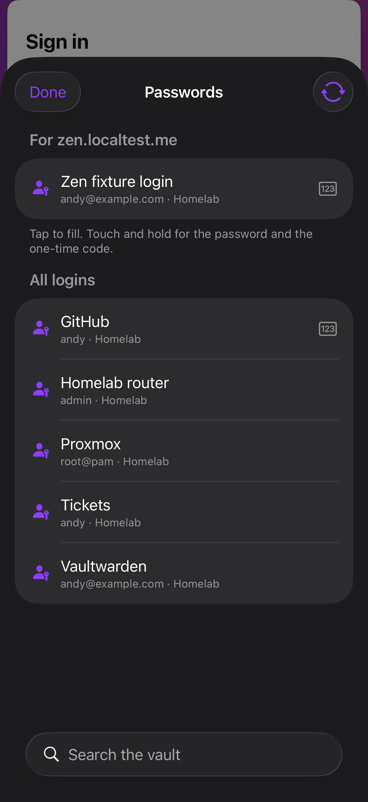 | 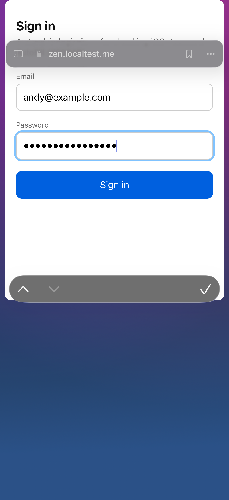 |
| Logins matching this page, exact host above same-domain | One tap fills; the page's own events fire, so a controlled input keeps it |
### The shape of it
`PasswordVaultProvider` is four verbs — prove the server is there, list logins,
fetch one login's secrets, write a login back. Everything above it is
provider-agnostic and tested once.
| | 1Password Connect | Bitwarden / Vaultwarden |
| Auth | Server URL + bearer token | Server URL + email + master password |
| Crypto on our side | None; Connect holds the unlocked vault | PBKDF2 → HKDF → user-key unwrap → AES-256-CBC + HMAC |
| Secrets in the bulk list | **No** — `reveal(_:)` does a per-item GET | Yes, in `/api/sync` |
| Can't read | — | Organisation ciphers (org keys are never unwrapped); counted and shown |
The Bitwarden crypto is ported from the Ghostty iOS app's
`Sources/Sync/Bitwarden`, adapted rather than copied: `swift-crypto` becomes
CryptoKit, and AES-CBC and HKDF are Zen's own `Sources/Sync/Crypto` rather than
a second copy of each. Ghostty's test vectors came with it. Argon2id keeps its
honest "not available in this build" seam — the homelab's Vaultwarden is
PBKDF2, and a silently wrong key fails as a 400 that looks like a mistyped
password, so refusing is the kinder answer.
### What is kept on the device, and where
- **Credentials** — keychain, `WhenUnlocked` + `ThisDeviceOnly`. Stricter than
  sync's `AfterFirstUnlock`, because nothing here runs in the background.
- **The domain index** — AES-GCM sealed under a *separate* keychain key. A
  plaintext list of every site you have an account with is a map of your life
  even with no passwords in it.
- **Passwords and TOTP secrets** — never written to disk. Not by discipline:
  `VaultIndexEntry` has no field to put one in, so the stripping is structural.
  A secret is fetched for the one row you act on and dropped.
Face ID gates revealing and filling. It **fails open when no biometry is
enrolled** — a simulator has none, and the alternative is a feature that cannot
be exercised on the machine it is built on. *Absent* biometry passes; *failed*
biometry does not.
### Matching, and why the tests are written from the attacker's side
Matching is the registrable domain — one label below the public suffix — with
an exact host ranked above a same-domain match, because the first row is the
one people tap without reading. The public-suffix table is a curated subset
rather than the full PSL, and says so in the source.
`DomainMatchingTests` spends as much room on what must *not* match as on what
must: `bank.com.evil.net`, `notbank.com`, `bank.co.uk` and
`evil.net/?next=bank.com` are all asserted against a login stored for
`bank.com`. It found a real one — a host that *is* a public suffix (`co.uk`)
claimed itself as a registrable domain, which would have pooled every
`*.co.uk` login into a single bucket.
### Filling
Bitwarden's heuristics, because they are the ones the extensions converged on
after years of bug reports: the password field is the anchor, the username is
the nearest *preceding* text input scored on name/id/placeholder rather than
first-matched, and a form with two password fields is a sign-up — fill the
first, never the confirmation.
Values are set through the prototype's native setter with `input` and `change`
events. A plain `element.value = x` leaves a React-controlled input looking
filled and submitting empty, which is the single most common "the password
manager is broken" report.
`LoginFormFillTests` runs the real scripts in a real `WKWebView` against nine
fixtures in `Tests/Fixtures/forms`, each named for the case a naive
implementation gets wrong — a search box above the form, a search box as the
only candidate *inside* it, zero-sized honeypots, a two-step sign-in with no
username field, a controlled input that reverts anything set without an event.
### The one injected script
`ios` asserts that Zen injects nothing into page content. This branch injects
exactly one thing — a submit listener, so a credential can be offered to the
vault — and **nothing at all until a vault is configured**, so anyone who does
not opt in gets the `ios` behaviour exactly.
Its passivity is measured rather than claimed: `PasswordsAutoFillTests`
captures the form's `outerHTML`, every input's attributes and the active
element before and after the observer runs, and compares them. The handler also
checks the message's URL against `WKFrameInfo.securityOrigin` — page script
cannot forge that — and ignores anything not on https.
### Settings
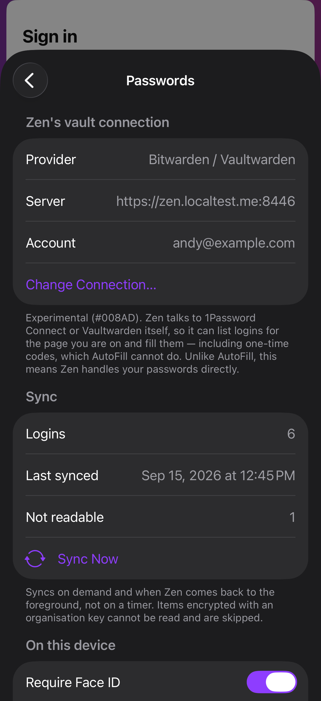
Provider setup, sync status, the Face ID toggle, clear-cache and forget-vault,
then the AutoFill explanation, which is true whether or not a vault is
connected. "Test and Save" tests *before* it saves: a stored server that has
never answered is a settings screen that lies to you.
### Testing it, and the two things that were measured rather than assumed
No 1Password Connect server and no Vaultwarden is reachable from the machine
this is built on, so the provider tests mock `URLProtocol` and every one of
those files says so in its header.
`Tests/Fixtures/mock-vaultwarden.py` closes the remaining gap. It speaks the
three endpoints the client calls and **encrypts its vault the way a real server
does**, so the app performs a genuine PBKDF2 run, HKDF stretch, user-key unwrap
and AES-CBC-then-HMAC decryption of every field. Nothing inside the app is
stubbed, which is what makes `BitwardenLiveMockTests` evidence that the ported
crypto is right rather than merely self-consistent. It is what the screenshots
above are taken against.
python3 Tests/Fixtures/serve.py            # mints the CA, once
python3 Tests/Fixtures/mock-vaultwarden.py
Two things that cost real time and are worth writing down:
- **A leaf certificate valid for more than 398 days is rejected by Apple's TLS
  policy**, inside the security framework and *before* any
  `URLSessionDelegate` runs — so "allow a self-signed certificate" cannot
  override it. The fixture CA used to mint ten-year leaves, which loaded
  perfectly in a `WKWebView` and failed every `URLSession` request with a bare
  "A TLS error caused the secure connection to fail". `serve.py` now mints
  397-day leaves.
- **A build made with `CODE_SIGNING_ALLOWED=NO` has no entitlements, so every
  keychain call returns -34018.** This is not specific to the vault — it
  applies to the Mozilla account's sync keys too. The symptom is a vault that
  connects, displays its server and account, and then reports "no password
  vault is set up yet" on the very next sync. `Sources/App/Zen.entitlements`
  declares the keychain access group, and the keychain tests skip rather than
  fail when there is no entitlement:
# Keychain-dependent tests need a signed build; drop CODE_SIGNING_ALLOWED=NO.
xcodebuild test -scheme Zen -project Zen.xcodeproj \
  -derivedDataPath /tmp/zenbuild
### Not done
- **Argon2id accounts.** The seam is there and refuses clearly; wiring a
  library is a dependency decision, not a code one.
- **Choosing which 1Password vault a *new* item lands in.** Connect item ids
  are only unique within a vault, so the provider packs `vaultId/itemId`, but
  a create picks a vault rather than asking.
- **Organisation ciphers**, which need RSA org-key unwrapping.
- **Two-factor Bitwarden accounts.** The client carries a `twoFactorToken`
  field; nothing prompts for one.


## Extensions

WebKit gained a WebExtensions implementation in iOS 18.4 — `WKWebExtension`
and friends — and it loads the *same package* Firefox and Chrome load. An XPI
is a ZIP; a CRX is a ZIP with a signing header on the front; a Safari web
extension's resource bundle is the unpacked form of the same thing. So Zen can
install all three, and does.

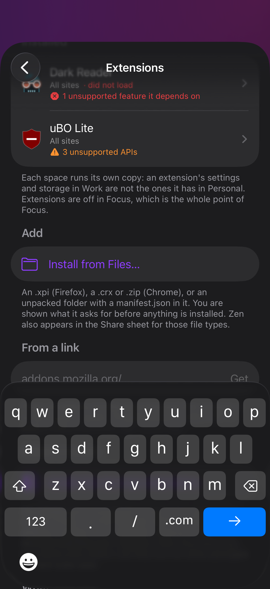

### The compatibility story

This is the part worth reading, because it is the part that will disappoint
somebody.

WebKit loads a Firefox extension and then **silently does less with it**. It
does not refuse the package, it does not log a warning, and the extension does
not know: `browser.sidebarAction` is simply not there, so the call throws
inside the extension's own background script where nobody sees it. The result
is an extension that installs cleanly, appears in the list, and does nothing —
which is the worst possible outcome for somebody who has just been asked to
grant it access to every site they visit.

So Zen reads the package **before** it loads it. The install sheet shows the
permissions and the host access, and next to them a compatibility report: the
manifest keys and the `browser.`/`chrome.` namespaces the package uses that
WebKit does not implement, with the file each one was seen in. Nothing here
refuses an install — it is a warning, not a verdict — and the same report is
shown again in Settings three weeks later when the question has become "why is
this not working".

What works, and what does not:

| | |
|---|---|
| **Content scripts** | Yes. Injected by WebKit itself, in its own world. |
| **`declarativeNetRequest`** | Yes — this is how a content blocker blocks. The rules are compiled by WebKit; the app never sees the requests. |
| **`storage`, `runtime`, `tabs`, `windows`, `scripting`, `alarms`, `cookies`, `webNavigation`, `i18n`, `permissions`, `commands`, `menus`** | Yes. |
| **Action popups and options pages** | Yes. The popup is WebKit's own web view in a sheet; the options page opens in a tab, as does `runtime.openOptionsPage`. |
| **Blocking `webRequest`** | **No.** WebKit's `webRequest` is observational: the listener runs, `{cancel: true}` does nothing. This is the single biggest difference, and it is why uBlock Origin *Lite* (declarativeNetRequest) works where classic uBlock Origin (blocking webRequest) does not. |
| **`sidebarAction` / `sidePanel`** | No. WebKit has no sidebar surface, so a sidebar-only extension has no UI at all. |
| **`contextualIdentities`** | No. Firefox containers have no WebKit equivalent — though Zen's spaces give you the isolation, if not the API. |
| **`bookmarks`, `history`, `downloads`, `management`, `privacy`, `proxy`, `sessions`, `topSites`, `idle`, `notifications`, `identity`, `theme`, `devtools`** | No. |
| **Persistent background pages (MV2 `"persistent": true`)** | **No — a hard failure.** iOS rejects the package outright with `WKWebExtensionErrorInvalidBackgroundPersistence`; only macOS allows one. |
| **Safari extensions from the App Store** | **No, and not for want of trying.** Apple ships them as app extensions bound to Safari; no third-party browser on any platform can load one. A Safari extension's underlying WebExtension folder installs like any other. |

The supported-permission list the scanner checks against is transcribed
directly from WebKit's own `WKWebExtensionPermission` constants rather than
from documentation, so it cannot drift away from what the framework will
actually match a manifest against. `ExtensionCompatibilityTests` pins it.

The scan is **static** and says so on screen: it reads the manifest and greps
the package's JavaScript for `browser.X` / `chrome.X`. Minification that
rewrites `chrome.tabs` to `c[t]` defeats it, and a call behind a feature test
(`if (browser.sidebarAction)`, which is exactly how a well-written
cross-browser extension copes) is reported even though the extension handles
it.

### One controller per space

Zen gives every space its own `WKWebsiteDataStore` so that signing into an
account in Work does not sign you in in Personal. A `WKWebExtensionController`
is bound to one data store — so a single shared controller would be a hole
straight through that isolation: `storage.local` written by an extension in
Work would be read by the same extension in Personal.

So there is one controller per space. The cost is real and the Settings screen
says so: an extension enabled in three spaces has three background pages and
three copies of its storage. For a content blocker that is exactly right; for
something that syncs state it is surprising.

**Focus mode gets no controller at all.** Focus promises an ephemeral session
with nothing written down, and an extension with `storage` and a background
page is the opposite of that. `AutoFillSuppressionTests.testFocusGetsNoExtensionController`
pins it.

### Installing an extension rebuilds the open tabs

Worth knowing because it looks like a glitch and is not.

Content scripts and blocking rules reach a page by different routes. WebKit
injects a content script per navigation, into whatever is already open — so
installing a content-script extension appears to work immediately. A
`declarativeNetRequest` rule list does not: it is compiled into the *web view's
configuration*, and a configuration cannot be changed once its view exists.
Reloading does not help.

So a tab that was open when a blocker was installed would show that extension's
content scripts and block nothing at all — installed, visibly running, and
silently useless. Rather than ship that, loading or unloading an extension
throws away every live web view and has them built again (`BrowserState.webViewGeneration`,
which `ContentArea` folds into each pane's identity). Pages reload; the scroll
offset survives, because the pool stashes it on the way out. A *permission*
edit does not do this — the page is not thrown away under you for a switch.

`ExtensionRuntimeTests.testInstallingABlockerAffectsATabThatWasAlreadyOpen`
pins the whole sequence against a real loopback HTTP server, which is the only
way to tell "blocked" from "failed": against a hostname that does not resolve,
every probe fails and the test passes whether or not the extension does
anything.

One thing neither the app nor the test can ask for: **when the rules are
live**. WebKit compiles a ruleset asynchronously once the context has loaded,
and publishes no signal for it — `WKWebExtensionContext` has `loaded` and
nothing about its rules — so `isLoaded` goes true some time before the first
request is actually blocked. A probe behind a fixed sleep therefore measures
how busy the machine is rather than what the browser does, and did: both
blocking tests passed and failed on the same commit within ten minutes of each
other. They now load the probe page again, on a freshly built view, until it
blocks or twelve passes have gone by, and report the pass count when they fail
so a real regression still reads as one. On an idle machine the first pass
blocks and the retry costs nothing.

### Tabs

`tabs.query`, `tabs.create`, `tabs.onUpdated` and the rest are answered out of
`BrowserState` through `WKWebExtensionTab` / `WKWebExtensionWindow`
(`ExtensionTabProxy`). Zen has more kinds of tab than the API does, so:

- essentials and pinned tabs report `pinned: true`, which is the nearest true
  thing the API can say about a tab that survives a close;
- a Glance card that has not been promoted is *not* in the tab list, because it
  is not in the sidebar either;
- `zen://newtab` is reported as `about:blank` — the sentinel is ours and means
  nothing to an extension;
- Focus tabs are invisible, per above;
- and `windows.remove` fails with a message rather than silently, because an
  app cannot close itself on iOS.

Tab events are driven from the view tree rather than by subscribing to the
model inside the runtime: `BrowserState` publishes on every keystroke in the
URL bar, and an extension has no business hearing about those.

### Permissions

Granting happens once, on the install sheet, and is editable afterwards in
Settings — per permission, per host pattern, and per site ("allow", "default",
"never" for whatever host is open). A runtime `permissions.request()` is
answered from those stored decisions rather than by throwing a dialog over the
page; anything not already granted is refused. That makes the install sheet
mean something, at the price of one more trip to Settings when an extension
grows a new appetite.

Turning a permission off on the install sheet **denies** it rather than leaving
it un-granted, and the difference matters: since Zen answers runtime prompts
from these switches, an un-granted permission would be one nobody is ever
asked about.

### It does not inject anything into your pages

Attaching a `WKWebExtensionController` to a `WKWebViewConfiguration` adds
nothing to its `userContentController` — WebKit injects an extension's content
scripts itself, in its own world. That is what lets extensions coexist with the
Password AutoFill invariant in the section above, and
`AutoFillSuppressionTests.testAttachingAnExtensionControllerInjectsNothingIntoPages`
asserts it rather than trusting this paragraph.

### Checking it works

Settings → Extensions → **Install the two test extensions** installs the app's
own fixtures:

- **Zen Badge** — an MV3 content script that writes a purple bar across every
  page, with an action popup, an options page, `storage` and `runtime`
  messaging. It also fetches one URL and reports whether the request survived.
- **Zen Blocker** — an MV3 `declarativeNetRequest` ruleset that cancels
  anything whose address contains `zen-blocked-resource`.

With both installed, `example.com` reads **ZEN EXTENSION ACTIVE - BLOCKED**:
the first half proves the content script ran, the second proves the rule
cancelled the request. (A missing file would read `REACHED 404` — the probe is
a `fetch` precisely so that a block and a 404 are distinguishable, which an
`` `onerror` handler cannot do.) `ScreenshotTests.testTheBuiltInExtensionsActuallyRunInAPage`
asserts both from the page.

These are the same two directories the unit tests load — one copy in the
repository, referenced by both the app target and the test target — so a
fixture that passes the tests is the fixture that gets installed.

| | |
|---|---|
| 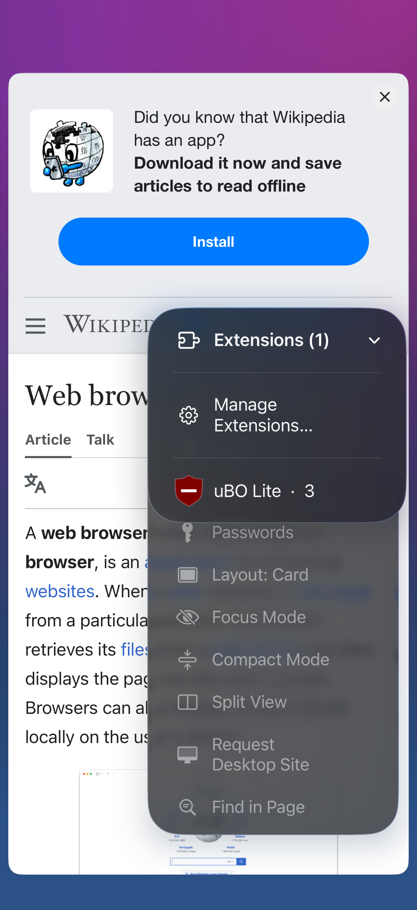 | 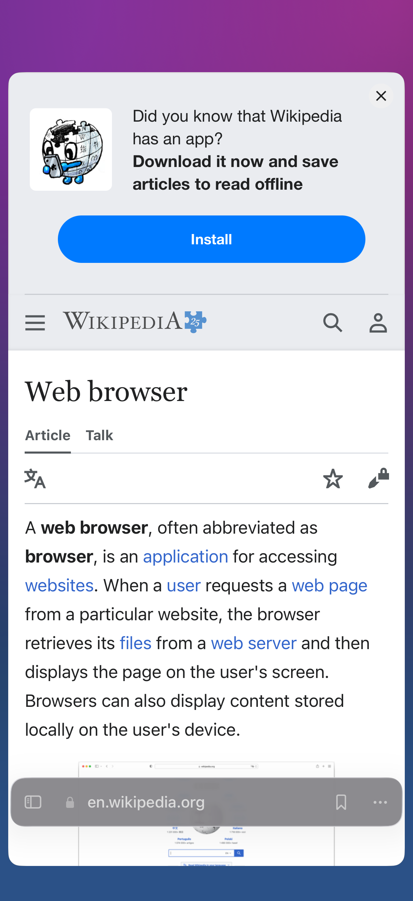 |
| An action popup — WebKit's own web view, in a sheet | A page loaded with a content blocker installed |

### Installing

Four routes, all landing on the same install sheet:

- **Files** — an `.xpi`, `.crx` or `.zip`, or an unpacked folder with a
  `manifest.json` in it.
- **The Share sheet**, and Files' "Open With" — Zen declares the XPI and CRX
  types, so an extension downloaded in Safari can be handed straight over.
  Declaring the types is only half of the job: the system then hands the app a
  file URL, and an app that does not answer that appears in the sheet, is
  chosen, launches, and does nothing. `ExtensionOpenURLBridge` answers it and
  lands on the same install sheet as every other route — scan, then ask, then
  install, which matters *more* for a package that arrived from outside the app
  rather than less. Since Zen never edits the file it was handed
  (`LSSupportsOpeningDocumentsInPlace` is false), what arrives is a copy in
  `Documents/Inbox` that nothing in the system ever deletes again: Zen deletes
  it once it has been read, including when it turned out not to be an extension
  at all. A file picked in Files is somebody's own document and is left exactly
  where it is.
- **A pasted addons.mozilla.org listing** — resolved to the current version's
  XPI through Mozilla's public v5 API, rather than by scraping a page that gets
  redesigned twice a year. A direct link to a package file is used as it
  stands.
- **The two built-in fixtures**, above.

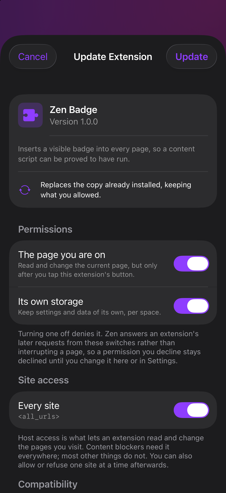

Above: an `.xpi` handed to Zen from outside the app, landing on the install
sheet. This one is already installed at the same version, so the sheet offers
to replace it and says what that keeps.

The ZIP reader is written here rather than taken from a dependency (this
project has none) and rather than delegated to WebKit — which *would* take a
ZIP as a `resourceBaseURL` — for two reasons: the compatibility scan has to
read the extension's JavaScript before anything is loaded, and an entry named
`../../Library/Preferences/x.plist` has to be refused before a byte is written.
It handles STORE and DEFLATE via `Compression`'s raw-DEFLATE decoder, which is
exactly the codec ZIP method 8 stores; no ZIP64, no encryption, neither of
which an extension uses.

### Not done

- **Keyboard commands.** `WKWebExtensionContext.commands` is read but nothing
  binds them to a chord — the iPad shortcut table in Settings is hard-wired.
- **`contextMenus` in the page's long-press menu.** The API is supported by
  WebKit and `menuItems(for:)` would supply them; Zen's own context menu does
  not merge them in yet.
- **New-tab page overrides.** `overrideNewTabPageURL` is deliberately ignored;
  Zen's start page is part of the space's identity.
- **Native messaging.** The permission is listed as supported because WebKit
  lists it, but Zen ships no companion app, so it reaches nothing.
- **`WKWebExtensionMessagePort`** (`connectUsing:`) is not implemented, for the
  same reason.


## Reader


Safari's Reader is Safari's. WebKit exposes no reader or readability API to a
third-party app, so Zen does what Firefox for iOS and Zen desktop both do: it
runs **Mozilla's Readability.js** over the page and renders the result itself.
The library is vendored verbatim at `Sources/Reader/Readability.js`
(Apache-2.0), with its provenance in a header comment.

### Two libraries, because they cost different amounts

`Readability-readerable.js` is about 4 KB and answers "does this look like an
article?" without parsing anything. That is cheap enough to ask of every page
that finishes loading, which is what lets the reader button *appear by itself*
next to the address instead of being a menu item that usually disappoints.

`Readability.js` is about 90 KB and rewrites a clone of the document. That is
not something to do on every page load, so it is evaluated only when the reader
is actually opened, and cached on `window` so a second opening of the same page
costs one function call. It runs on `document.cloneNode(true)` — Readability
mutates what it is given, and gutting the live page would leave nothing to go
back to.

**Neither is a user script**, and that is the load-bearing part (#008AB). A
`WKUserScript` runs in every page, including the one you type a password into,
and one that touches login markup stops iOS recognising the fields — Password
AutoFill then goes quiet with no error to explain it. Both scripts are
`evaluateJavaScript` into the isolated `.defaultClient` content world, on
demand. `ReaderExtractionTests` pins that the browsing configuration still
carries exactly one user script, the media observer.

### The controls

| | |
|---|---|
|  |  |
| The panel at its medium detent — the article stays live above it | Dark, one of five themes |
|  |  |
| Custom: background, text and link colours picked with #0088F's colour tool | Read aloud, with the sentence being spoken highlighted |

Nine typefaces, size, line height, letter spacing, paragraph gap, three column
widths plus a measure slider, left or justified with hyphenation, an in-reader
dim, images on or off, a drop cap, reading progress and estimated time, and the
speech rate. Five themes — light, sepia, dark, true black, and a custom one
whose background, text and link colours go through the same wheel, brightness
track, HSB/RGB sliders and validated hex entry that pick a space accent.

Every control is a **CSS custom property** or a class on `<html>`, set through
one `evaluateJavaScript`. Nothing reloads, because a reload loses your place in
a long article and an appearance control that scrolls you back to the top is
one you use once. The initial document and the live update are generated from
the same function, so the two cannot drift.

The panel is a sheet at `.medium` with `presentationBackgroundInteraction`
enabled. That property is most of the difference between a control panel and a
preferences screen: the article stays visible and live above the sheet, so
dragging the size slider is something you watch happen.

### Per-site memory

| | |
|---|---|
|  |  |
| Settings → Reader: the defaults, previewed on type rather than described | The sites that have since disagreed, and the one button that forgets them |

The point of a reader's controls is that you set them once, and setting them
once *globally* is not enough — a site whose own type is small is a standing
exception. So the lookup is two-level: an override per **registrable domain**
falling back to the global default in Settings → Reader. It follows the same
convention `PageZoom` uses for text size (#008B7): its own small JSON document,
a short public-suffix table rather than the whole list, and a bare IP or
single-label homelab host as its own key.

### Judgement calls

- **No fonts are bundled.** Every face on offer is already on the device: the
  four system families plus the book faces Apple ships (Georgia, Palatino,
  Charter, Avenir Next, New York). Vendoring web fonts would cost a megabyte, a
  licence review and a second rendering path, and would buy a reader nothing
  they cannot already get.
- **The read-aloud highlight is drawn, not inserted.** Marking the spoken
  sentence with a `<mark>` needs `Range.surroundContents`, which throws the
  moment a sentence crosses an inline element — and a sentence containing a
  link is most of them. So the highlight is a set of absolutely positioned
  rectangles taken from `Range.getClientRects()`, painted behind the text.
  Nothing in the article moves.
- **The synthesizer gets one sentence at a time.** One utterance per sentence,
  the next enqueued only when the last finishes. That costs a barely
  perceptible beat between sentences and buys an exactly known current
  sentence — so the highlight cannot drift — and a skip that is "stop and start
  the next one" rather than queue surgery.
- **Sentence offsets are UTF-16**, because that is what a JavaScript string
  index counts. The reader page hands Swift its own flattened text index and
  the chunking happens over that, so an offset pair always maps back onto a
  real DOM range. One emoji before the text would otherwise put every later
  highlight a character out, silently.
- **Leaving the reader is removing a layer.** The reader is a second
  `WKWebView` over the page, not a takeover of it, so the article's own web
  view is untouched underneath — same scroll offset, same history. There is no
  position to restore and so nothing that can fail to.

### Not done here

- **The probe is Mozilla's heuristic, and it is a heuristic.** It says no to
  pages that read perfectly well in the reader, which is why *Show Reader* is
  in the overflow menu as well as on the bar.
- **Cross-origin `<iframe>` content is out of reach**, as it is for everything
  else a script can see.
- **No "reader by default for this site".** The per-site memory remembers how
  an article looks, not whether to open the reader automatically.

## Screenshots

| | |
|---|---|
|  |  |
| A loaded page, the space gradient framing the content | A second page in the same space |
|  |  |
| The centered floating search box with suggestions | Glance: a link as a card over the dimmed page |
|  |  |
| Split view with a draggable divider (stacked in portrait, side by side when wide) | The persistent sidebar on iPad |
|  |  |
| Split view on iPad, where the panes sit side by side | Compact mode: the bar is gone, the grabber remains |

### When a page will not load


A failed load used to leave a blank page and an untappable warning glyph. It
now explains itself: host, port, reason, the underlying error code in small
text, Retry, the other scheme, and — when the default port was refused — the
ports homelab services actually sit on (8006 for Proxmox, 8080, 8443, …).
LAN addresses also get the Local Network permission hint, because a declined
prompt fails every connection afterwards with no visible cause.

### The status bar, and the new-tab strip

| | |
|---|---|
|  |  |
| Hidden by default, so the page runs to the very top edge | New Tab as a pinned full-width strip, not a row that scrolls away |

### Importing a palette for the code lookup

The colour tool's **code lookup** searches a palette file you supply. Zen does
**not** ship Pantone, RAL or NCS values: those are licensed, and a table of
approximations published under those names would be both a licence problem and
simply wrong about the colour. Your own palette is yours to own, so import it.

Tap **Import palette…** under the colour wheel and pick a `.json` file. Three
shapes are accepted, because all three are what real tools export:

```json
{
  "name": "Morton brand",
  "colors": [
    { "code": "PB-101", "name": "Deep Sea", "hex": "#0B3D5C" },
    { "code": "PB-102", "name": "Paper",    "hex": "#F4ECD8" }
  ]
}
```

```json
[ { "name": "Ink", "hex": "#101010" } ]
```

```json
{ "Ink": "#101010", "Paper": "#F4ECD8" }
```

| Key | Required | Notes |
|---|---|---|
| `name` (top level) | no | The palette's title. Falls back to the file name. |
| `colors` | yes¹ | Also accepted as `swatches`. |
| `hex` | yes | Also `value`, `color`, `colour`. `#RRGGBB`, `RRGGBB` or `#RGB`. |
| `code` | no | Also `id`. What the **code lookup** searches. |
| `name` (per entry) | no | Also `title`. Falls back to `code`, then to the hex. |

¹ Not needed for the flat `{ "Name": "#HEX" }` shape.

An entry with an unreadable colour is dropped rather than failing the whole
import — one bad row should not cost you the other ninety-nine. Importing a
palette whose name matches one already there replaces it, so fixing a typo and
importing again does not leave two near-identical sets to search.

### The colour tool

| | |
|---|---|
|  |  |
| Wheel, brightness track, HSB/RGB sliders, recents | Typed hex, validated and applied |
| 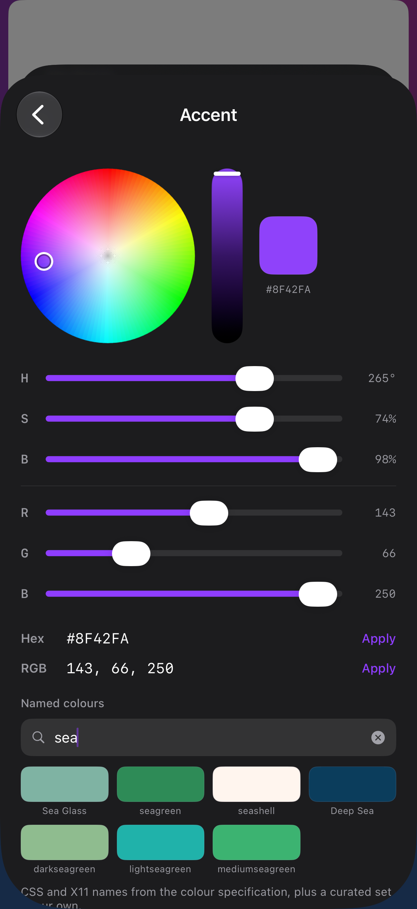 | 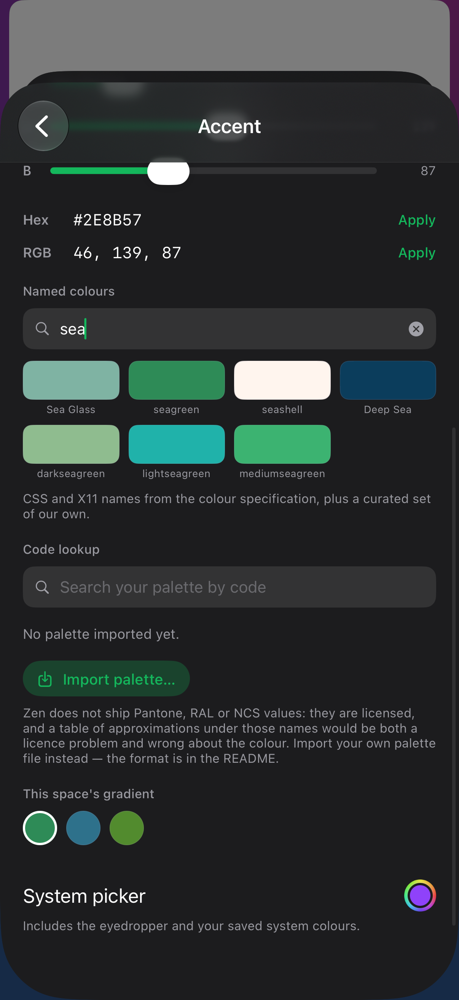 |
| Searching `sea` ranks seagreen and Sea Glass above lightseagreen | The code lookup over an imported palette, and why there is no Pantone |

### Sepia, and the bar fill

| | |
|---|---|
| 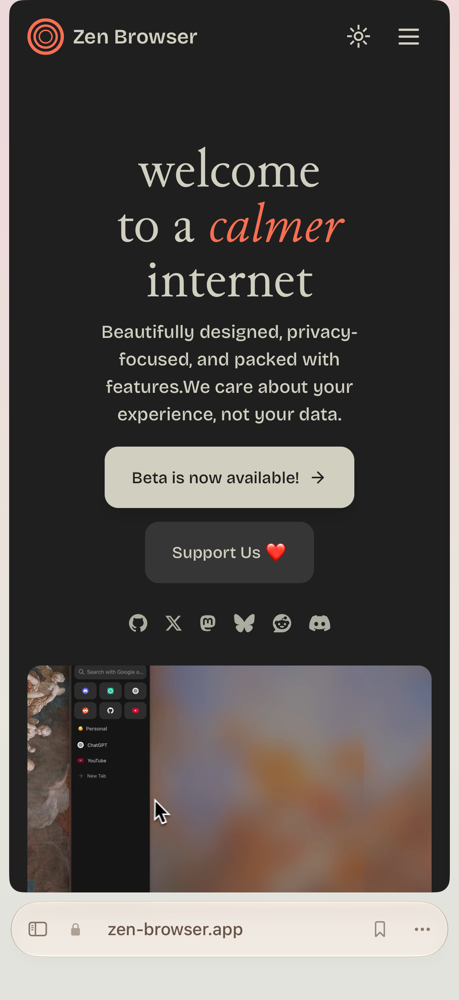 | 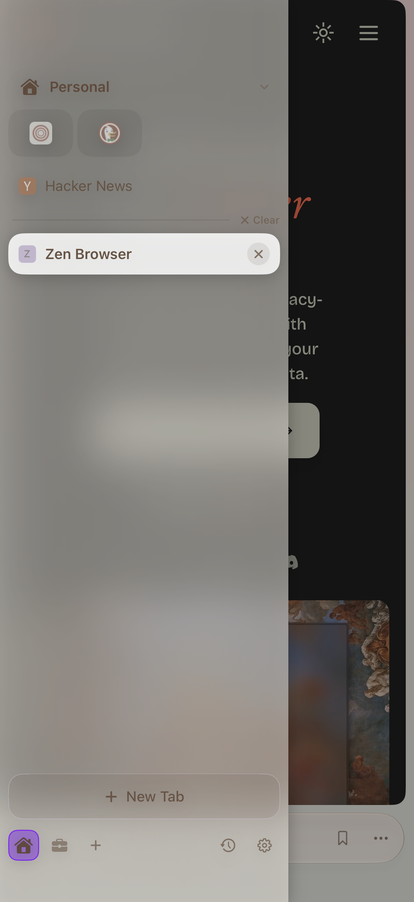 |
| Warm paper chrome, derived rather than tinted | The sidebar and the new-tab strip in paper and ink |
| 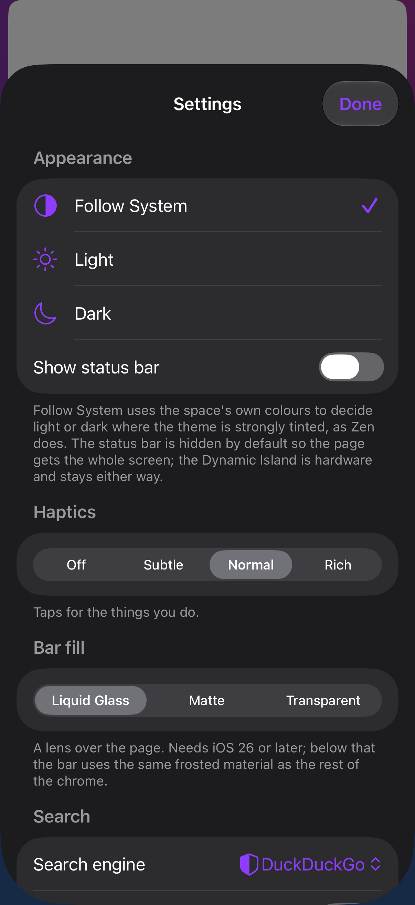 | 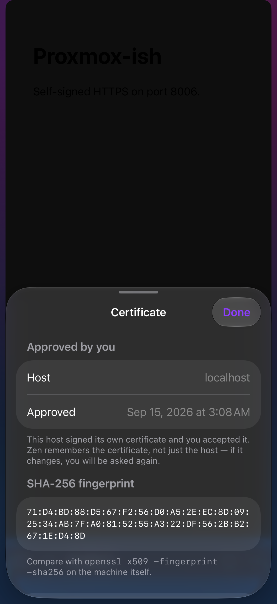 |
| Liquid Glass / Matte / Transparent | The badge opens the certificate record, fingerprint and all |
### Focus mode and LAN certificates

| | | |
|---|---|---|
| 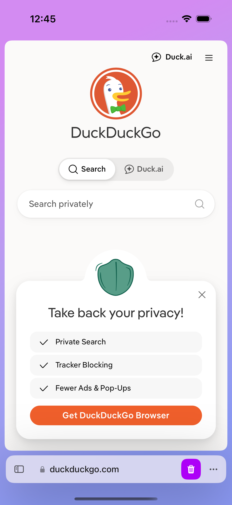 | 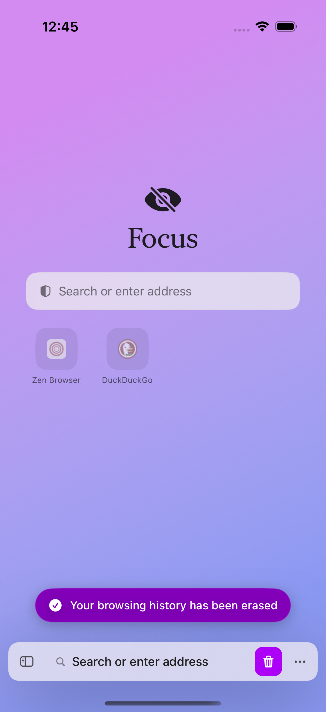 | 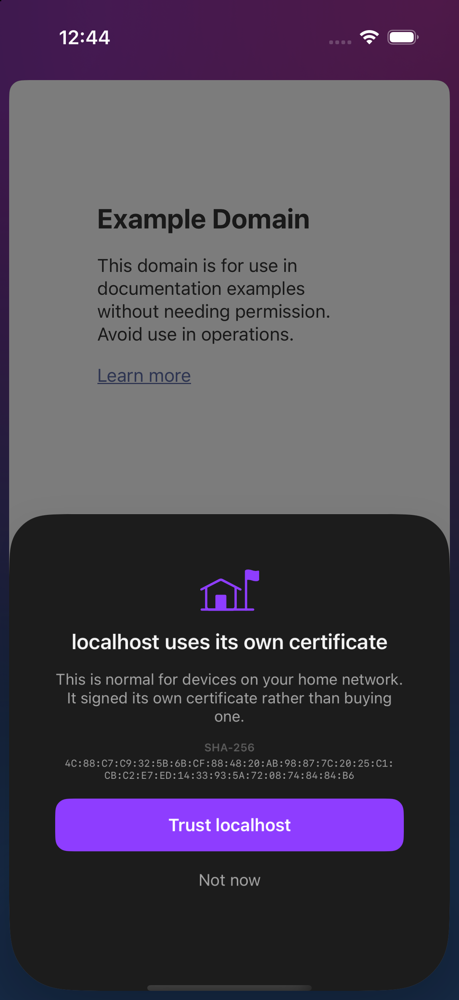 |
| **Focus** — purple, ephemeral, trash button in the bar | **Erase** — the session is gone, and says so | **LAN certificate** — calm and specific, fingerprint shown |

The certificate shot is from a real self-signed HTTPS server on `localhost`
(which classifies as local): the SHA-256 in the sheet was checked against
`openssl x509 -fingerprint -sha256` and matched. It is captured out of band —
see the note in `Tests/ZenUITests/ScreenshotTests.swift` for why XCUITest
cannot drive an app that is deliberately blocked on a challenge handler.
### Customize the bar (#00896)

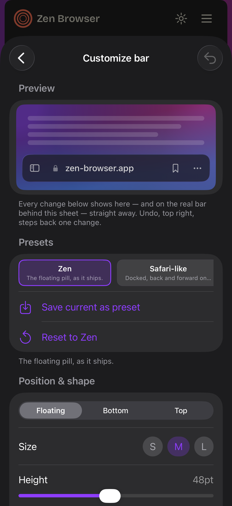

Quiche Browser on iOS is the reference, and the thing worth copying is not the
list of options — it is that **the preview is the real control**. It sits at the
top of the editor, it is the actual `OmniboxPill` drawn but not wired up, and
every section below changes what you are already looking at. A hand-drawn mock
would agree with the bar right up until it stopped.

Everything is one persisted, versioned `BarLayout`:

| | |
|---|---|
| **Position & shape** | Floating (default), bottom docked or top docked; height as S/M/L or a slider; corner radius, side margin, offset from the edge; pill or full width. |
| **Fill & look** | The Liquid Glass / Matte / Transparent choice, or a custom colour with its own opacity; blur strength; border and shadow on or off; URL text size; the accent from the space or fixed; haptics from the bar. |
| **Pill contents** | Favicon, security badge, domain / full URL / page title, progress as a line under the bar or a fill across it, and a find button. |
| **Buttons** | Left, right and overflow slots, filled by dragging from a library of 22 actions. Four per side, twelve in the overflow. Each button takes an optional second action on a long press. |
| **Gestures** | Swipe left, right, up and down, long press and double tap, each assignable from the same library. |
| **Auto-hide** | Never, on scroll, or follow compact mode — with separate landscape overrides for position and rule. |

Four presets ship — **Zen** (the bar as it has always been), **Safari-like**,
**Quiche-like** and **Minimal** — and "Save current as preset" keeps your own.
Export writes plain JSON; import reads it back.

| | |
|---|---|
| 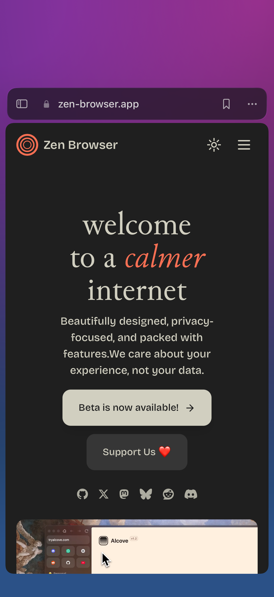 | 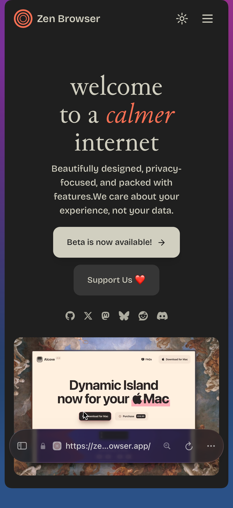 |
| **Top docked** — the page gives up the top edge, and the reveal grabber moves with it | **Quiche-like** — tall, round, favicon, full URL, reload in the bar, progress filling the surface |
| 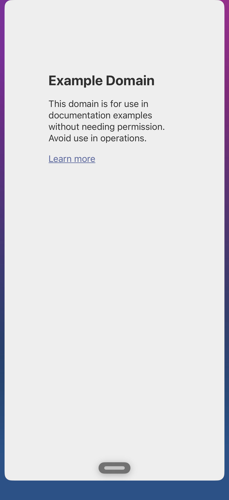 | 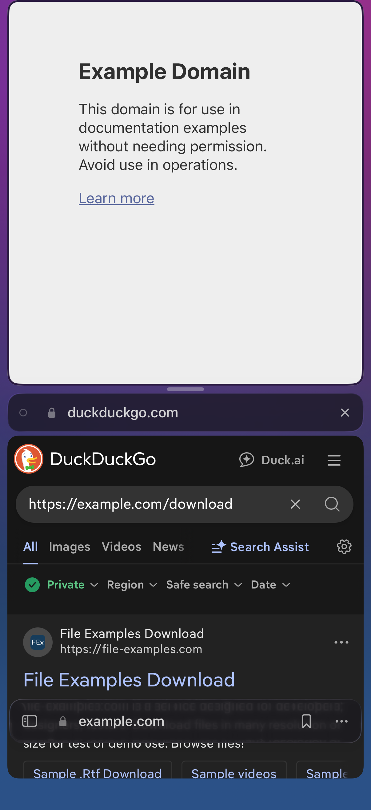 |
| **Hidden** — swipe down puts the bar away; the grabber brings it back | **Split view** — each pane's bar follows the same layout |

Three decisions worth stating:

- **Decoding never throws.** Every field goes through a `lenient` accessor, so a
  session file written by an older build picks up defaults for what it predates,
  and one written by a *newer* build keeps everything this build understands
  rather than losing the lot. An unknown `position`, or a slot action that does
  not exist here yet, is dropped on its own. `ZenSettings` learned half of this
  lesson when a missing key would have wiped everyone's tabs; this is the rest of
  it.
- **The undo stack replaces Cancel.** A sheet you have to commit or discard makes
  experimenting expensive, and the whole point of a live preview is that
  experimenting should be cheap. Slider drags coalesce into one entry, or sixty
  frames of a drag would fill the stack with near-identical layouts.
- **Erase is not customisable.** In Focus mode the erase button is always on the
  bar, because that is the promise the mode makes (#00888). Everything else can
  be taken away.

**No reader affordance.** The brief asked for one; WebKit exposes no reader or
readability API to third-party apps, so a Reader button would be a control that
does nothing. The find affordance is real and is in the contents section; reader
stays in the "not done" list below until there is something to put behind it.

### Local network (#0089C)

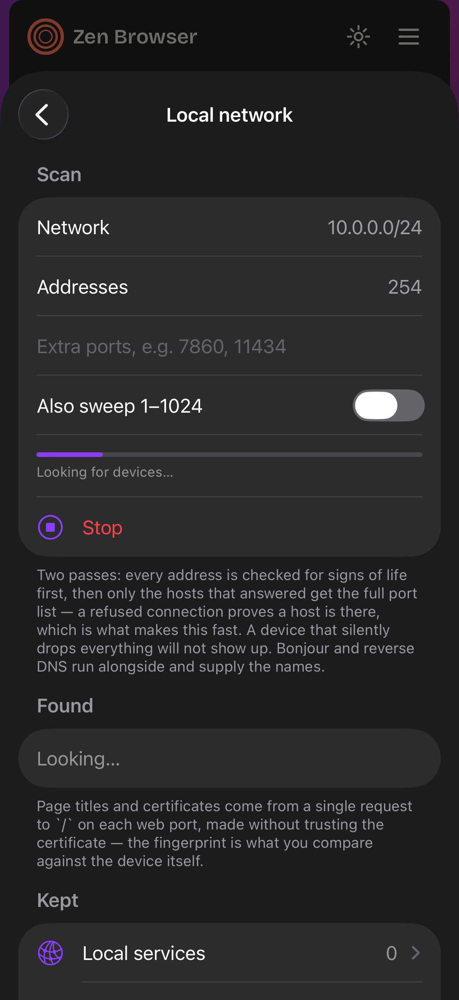

A homelab is a browser's most-visited set of sites, and the one set no search
engine can help with: the addresses are private, the names only resolve inside
the house, and half of them are a port number you have to remember. So
**Settings › Local network** finds them.

**The scan is two-phase, and that is the whole design.** The naive version — a
/24 against 23 ports — is 5,800 connects, and a *dead* address never answers, so
every one of them costs the full timeout. At 64 in flight that is a minute and a
half. But "refused" and "silent" are different answers: a host that is there
sends a RST immediately even on a port it is not serving. So one pass over the
subnet on ports 80, 443 and 22 finds the hosts, and only those get the full port
list — twenty hosts instead of two hundred and fifty.

The cost of that trade is stated in the UI rather than hidden: **a device that
silently drops everything will not show up.** Bonjour runs alongside and can add
hosts the first pass missed.

- **Ports.** The homelab's actual shape rather than nmap's top-1000: 22, 80, 443,
  445, 631, 1883, 2222, 3000, 3389, 5000, 5432, 5900, 8000, 8006, 8080, 8096,
  8123, 8384, 8443, 9000, 9090, 9443, 32400 — the hypervisor, the media servers,
  the automation hub, the metrics stack, the admin panels. Plus whatever you
  type, plus an opt-in 1–1024 sweep with a warning attached, because a full
  low-port sweep looks exactly like a port scan to anything watching.
- **Names.** `NWBrowser` over the twelve Bonjour types in the Info.plist, each
  resolved to an address by one throwaway connection, and reverse DNS for the
  rest.
- **Titles and certificates.** One `GET /` on each web port, 3s timeout. The
  session accepts a self-signed certificate **for that request only** — nothing
  is written to the trust store — and captures the leaf's SHA-256, subject and
  expiry on the way past. That fingerprint is the number you compare against the
  box itself.

> iOS has never exposed `SecCertificateCopyValues`, so the expiry is read out of
> the DER by hand — a walk down exactly the path `notAfter` sits on, returning
> nil the moment anything is not the shape expected. It is tested against a
> certificate OpenSSL actually emitted, not a fixture built to match the parser.

| | |
|---|---|
| 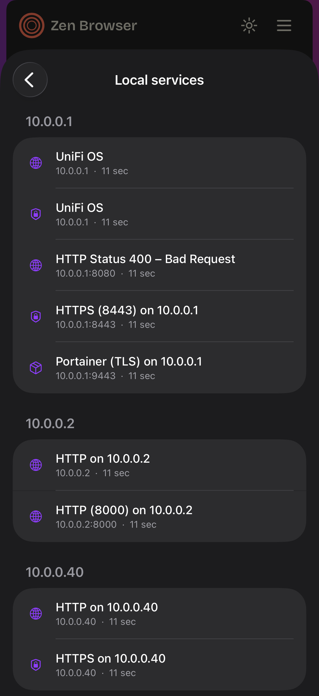 | 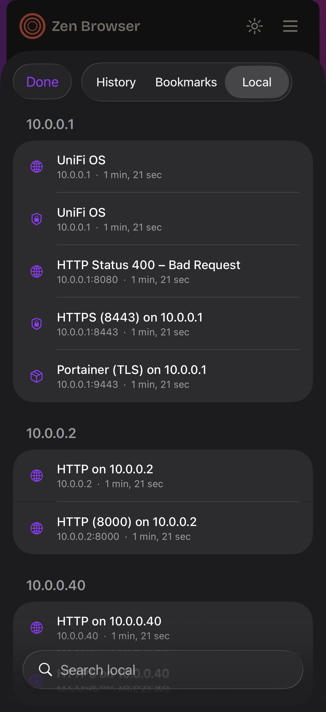 |
| What you kept: alias, address, last seen | Local sits beside History and Bookmarks, because it is the same kind of thing |

Import what you want; each one gets an alias seeded from the page title, the
Bonjour name or the service kind, editable inline. Then **the alias is something
you can type**: `proxmox` on its own in the address bar goes straight there.
Exact, whole-string and case-insensitive only — anything looser and typing `mail`
would stop searching for mail, which is the mistake the single-word rule already
refuses to make in the other direction. Partial matches show up as suggestions
instead.

Re-scanning updates last-seen and **flags a changed certificate rather than
quietly accepting it** — a different certificate on a host you trusted is the one
finding worth interrupting for, which is the same line #00889 draws from the
other direction.

**Trust certificates** is its own button, never a side effect of importing. It
approves what the imported HTTPS services are currently serving, and then shows
you exactly what it approved — host, subject and fingerprint. A button that
silently approves things is not a button anybody should press.

### The layout cycle

| | | |
|---|---|---|
| 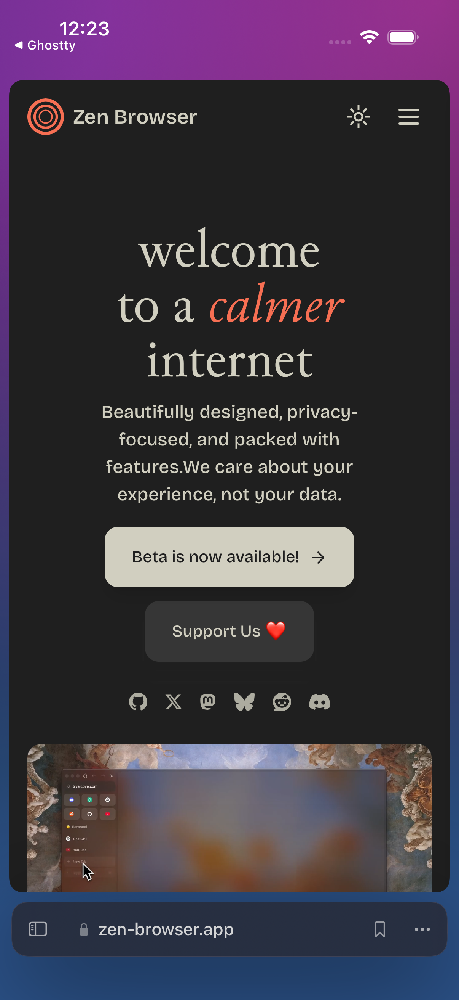 | 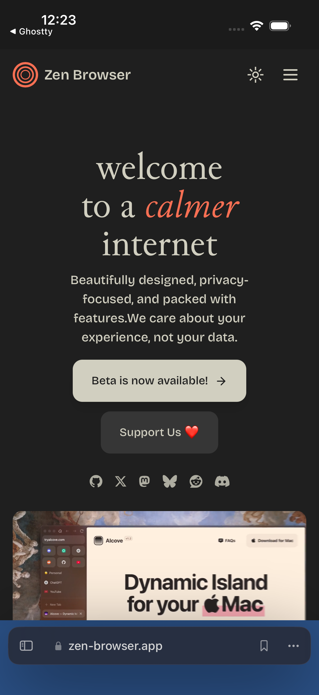 | 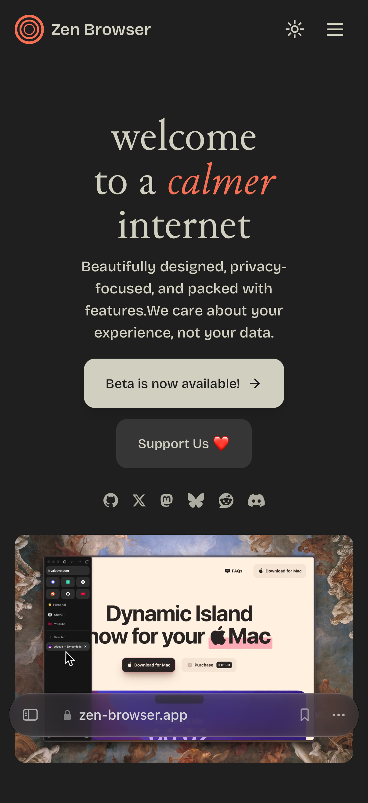 |
| **Card** — the page inset, gradient framing it | **Edge to edge** — page to the top, bar in flow | **Full screen** — bar floating, no backing material |

## Licence

Zen is MPL-2.0; this directory follows the repository's licence.
