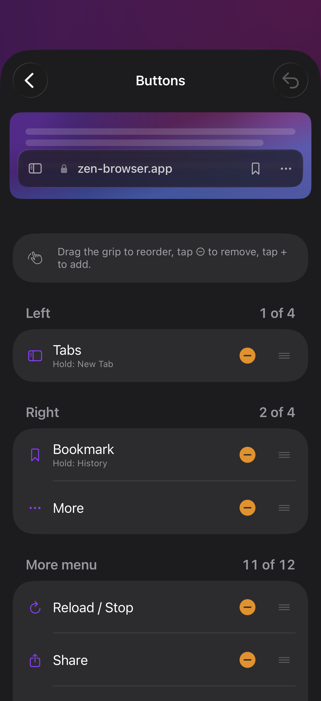
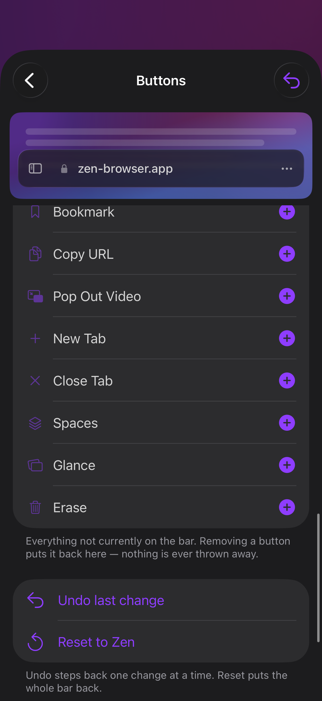

# Customize bar — a walkthrough

Ticket #008AC. Written after driving the editor in the simulator through the
tasks below, one at a time, and fixing whatever took more than one obvious tap.

Settings → **Customize bar** → **Buttons**.

## What you are looking at

Top to bottom:

- **The live preview.** The real `OmniboxPill`, drawn but not wired up, over a
  stand-in page. Everything you do below shows here immediately — and on the
  actual bar behind the sheet.
- **A hint line** — *Drag the grip to reorder, tap ⊖ to remove, tap + to add.*
  It says what actually works. Two earlier versions of it did not; see below.
- **Left**, **Right** and **More menu**, each with a count: `1 of 4`,
  `2 of 4`, `11 of 12`. Left and right hold four buttons each; the More menu
  is a list, so it holds twelve.
- **Library** — every action that is *not* currently on the bar.
- **Undo** and **Reset**, at the bottom, next to the destructive verbs rather
  than only in the toolbar. Undo is in the top right as well.

Every slot row carries a red minus and a drag grip, always visible. There is no
Edit button to find first.

## Removing a button

Three ways, all of which work, because these are the three things people try:

1. **Tap the red minus** on the row. One tap, no confirmation — what it
   removes goes into the library below and Undo is on the same screen.
2. **Swipe the row left** and tap *Remove*. (No full swipe — a button that
   disappears the moment your thumb passes the screen edge is too easy to do
   by accident while scrolling.)
3. **Press and hold** the row and choose *Remove* from the context menu.

A removed button is not destroyed — it drops into the **Library** below, and
putting it back is one tap on the `+`.

## Adding a button

Tap the library row — the whole row is the control, not just the `+` at the end
of it. It asks where: *Add to the left*, *Add to the right*, *Add to the More
menu*. Slots that are full are greyed out rather than silently refusing.

You can also drag a library row straight onto a slot.

## Reordering

- **Inside a slot:** drag the grip at the right-hand end of the row onto the
  row you want it above or below — or press and hold and pick *Move up* /
  *Move down*.
- **Between slots:** drag the row onto another slot — or press and hold and
  pick *Move to the left* / *the right* / *the More menu*.

The drag-free fallbacks exist because dragging inside a sheet, inside a scroll
view, on a phone, is more trouble than it is worth often enough to matter.

Reordering inside a *full* slot works: nothing is being added, so the capacity
check does not apply.

## Undo and Reset

**Undo** steps back one change at a time (sliders coalesce into one entry, so
dragging a slider is one undo, not sixty). **Reset** puts the whole bar back to
the preset it came from — *Reset to Zen* unless you started from another one.

## Presets and position

Back on the Customize bar screen:

- **Presets** — Zen, Safari-like, Quiche-like, Minimal. A preset is a *whole*
  layout, not a set of tweaks: applying one replaces position, shape, contents,
  buttons and gestures together. **Save current as preset** keeps yours under a
  name.
- **Position** — Floating, Bottom (docked), Top. Docked puts the bar in the
  layout flow so the page gets pushed up; floating puts it over the page.

## The seven tasks, and what they cost

Driven in the simulator via XCUITest (`testDogfoodTheBarCustomizer`):

| Task | How |
| --- | --- |
| Remove Bookmark from the right slot | 1 tap on the minus — **automated** |
| Take Focus mode out of the More menu | 1 tap on the minus — **automated** |
| Undo the last change | 1 tap — **automated** |
| Reset to Zen | 1 tap — **automated** |
| Add an action to a slot | 2 taps — row, then *Add to the left* |
| Move Share from the More menu to the left | 2 taps — hold, *Move to the left* |
| Reorder Back and Forward | 1 drag on the grip, or hold → *Move up* |
| Position → Docked at the bottom | 1 tap on the segmented control |
| Save as a preset | 3 taps — *Save current as preset*, name, *Save* |

The four marked **automated** are asserted end to end by
`testDogfoodTheBarCustomizer`. The rest were driven by hand in the simulator
and checked against the screenshots above; they resisted reliable XCUITest
addressing (SwiftUI does not expose a `Menu` nested in a list row as its own
element consistently), which is a gap in the test, not in the feature.

## What changed because of this walkthrough

- Removal had been *only* a context-menu item on a chip in a horizontally
  scrolling row. Nothing on screen said a chip could be taken away, and
  press-and-hold is not an affordance — it is something you have to already
  know. This is the bug Andy hit.
- The library listed **every** action, including the ones already on the bar,
  so it could not answer "where did my Bookmark button go?". It now lists only
  what is unplaced.
- The header said *Overflow menu* while the button it fills is labelled
  **More**. The editor now names what you can see.
- The count read `3/4`, which scans as three quarters. Now `3 of 4`.
- Undo and Reset were in the toolbar of the screen above, scrolled away by the
  time you were editing buttons. They are now on the same screen as the
  destructive actions.

### Three bugs the driving found

1. **The list was pinned in edit mode** to get free reorder grips and a free
   minus. A `List` in edit mode does not deliver taps to buttons inside its
   rows — so the explicit Remove and the library's add control were both dead,
   and `.swipeActions` was suppressed as well. Three affordances that looked
   right in a screenshot and did nothing at all. Edit mode is gone; the grip
   and the minus are drawn by hand.
2. **The row carried an `accessibilityLabel`**, which merges a container into
   one accessibility element and takes its children with it. The remove button
   was visible, was tappable by a finger, and was invisible to XCUITest — and
   would have been invisible to VoiceOver too. Now `.accessibilityElement(children: .contain)`.
3. **The hint line described the wrong gesture** twice: first "swipe to
   remove" while edit mode was suppressing swipes, then a minus that was not
   yet reachable. It now names the control that is guaranteed, first.

## Known gaps

- Drag-and-drop *between* slots works but is fiddly on a phone; the *Move to…*
  context menu is the reliable path and is why it exists.
- The add and move steps are not covered by the UI test — see the table above.
  The model behind them is covered by `BarSlotMutationTests` (17 cases).
- The preview shows the bar's own layout, not compact mode's collapsed pill.
  Expanding the pill on the real bar gives back this layout (#008AF), which is
  the property that matters.
